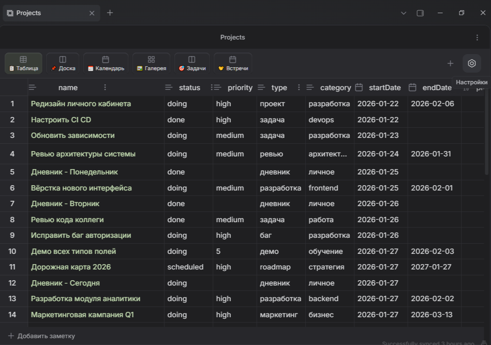
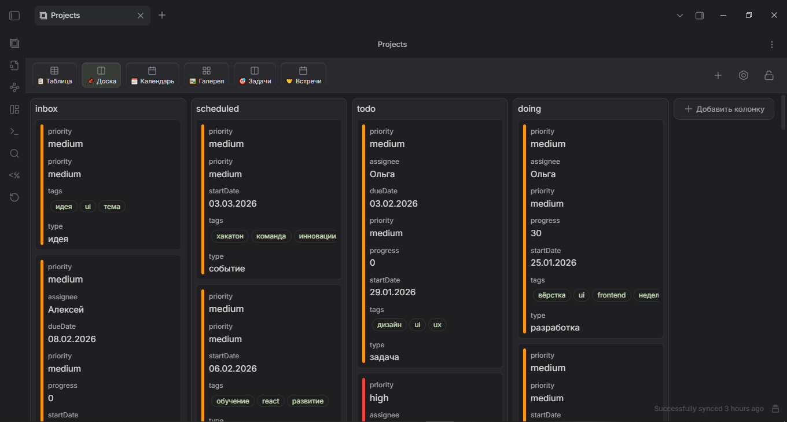
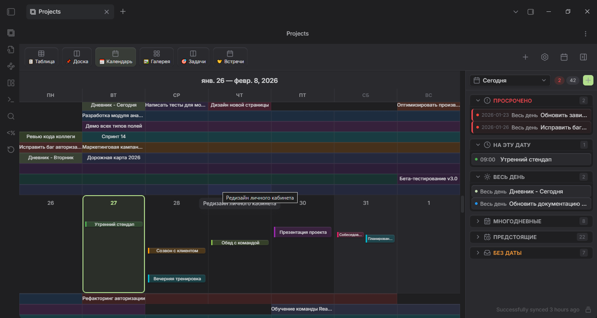
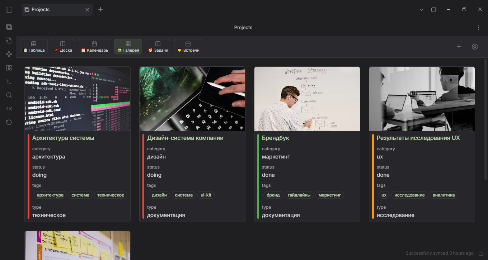
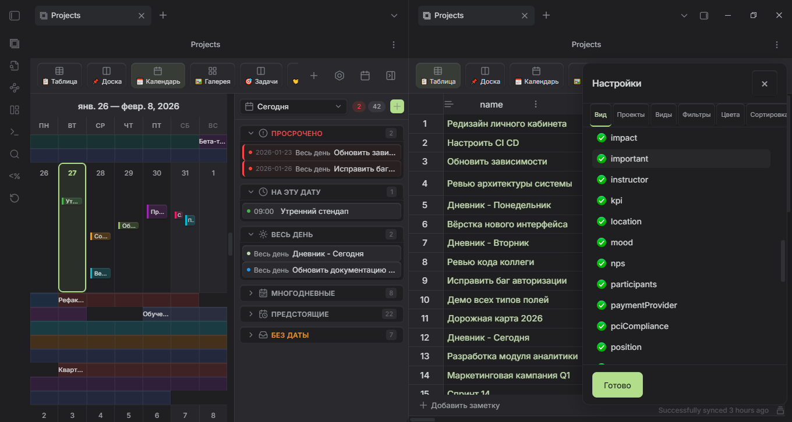
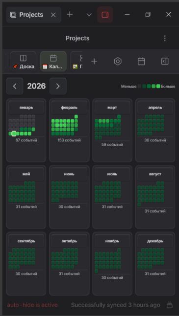
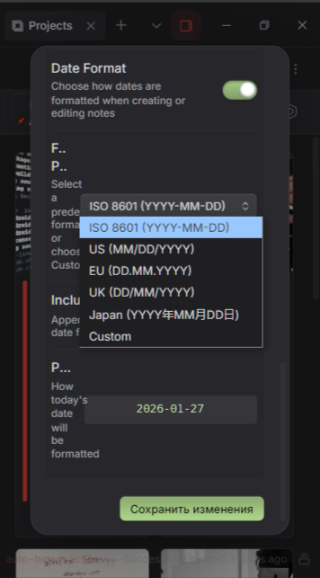
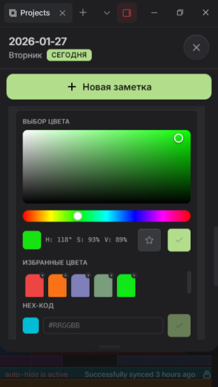
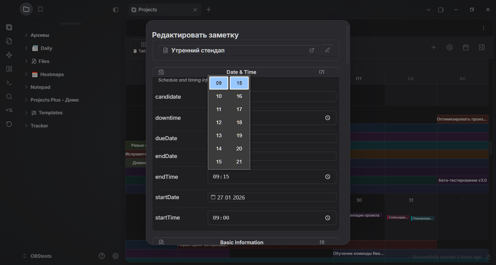

# OBS Projects Plus

<div align="center">


[](https://github.com/ParkPavel/obs-projects-plus/releases)
[](https://t.me/parkpavel_chigon)

**Your Markdown files as a database: tables, kanban, calendar, gallery, interactive Dashboard**

[Русский](README.md) | English

</div>

---

> **Status: alpha 3.6.0 — active development**
>
> Board, Calendar and Gallery are stable and fine for daily use.
> Dashboard is the youngest part of the plugin. It already composes blocks and links them to
> each other, but its configuration and appearance still change between versions, so a saved
> Dashboard may look different after an update. Your notes are not affected — only the view
> configuration is.

---

## Why this plugin?

Obsidian stores everything in plain Markdown files. **Projects Plus** reads the frontmatter of your notes as structured data — **your folder is already a database**, no import or migration required.

Edit a field in the table — it writes back to the frontmatter. Edit the frontmatter by hand — the Dashboard updates immediately. **One entity, two interfaces.**

### Who it's for

- **Clinical practitioners** (massage therapists, psychologists, coaches) — client database + sessions + progress tracking
- **Researchers** — sources, notes, deadlines with filtering and cross-analytics
- **Project managers** — tasks, meetings, statuses without leaving Obsidian
- **Anyone with a knowledge base** — when you need a visual overview, not a file list

### How it works

1. You point to a **folder**, **tag**, or **Dataview query** — this is your "project"
2. The plugin reads the `frontmatter` (YAML header) of all matching notes
3. You pick a **view** — Dashboard, board, calendar or gallery
4. Edit fields right in the interface — the plugin writes changes back to the file

**Your data stays in your files.** No proprietary database.

---

## Gallery

<p align="center">
  
  
  
  
  
</p>
<p align="center">
  
  
  
  
</p>

<details>
<summary align="center"><b>Click to view full size</b></summary>
<p align="center">
  <a href="images/2026-01-27_12-23-33.png"></a>
  <a href="images/2026-01-27_12-23-55.png"></a>
  <a href="images/2026-01-27_12-24-17.png"></a>
  <a href="images/2026-01-27_12-24-35.png"></a>
  <a href="images/2026-01-27_12-26-03.png"></a>
  <a href="images/2026-01-27_12-26-43.png"></a>
  <a href="images/2026-01-27_12-27-29.png"></a>
  <a href="images/2026-01-27_12-29-16.png"></a>
  <a href="images/2026-01-27_12-30-02.png"></a>
</p>
</details>

---

## Features

| View | What it does | Status |
|---|---|:---:|
| **Board** | Kanban: drag cards, columns stay in place, `Ctrl` + scroll zoom (25–200%) | Stable |
| **Calendar** | Timeline 07:00–22:00, multi-day bars, 5 zoom levels (year → day), mobile gestures | Stable |
| **Gallery** | Cards with covers and frontmatter fields | Stable |
| **Dashboard** | A screen of blocks: a table, board, calendar or gallery per block, links between blocks, charts | Alpha |

**A table is not a separate view.** It opens as a data block inside a Dashboard: sorting, filters,
cell editing, column totals and formula columns.

**Calendar** — a full planner: `startDate`, `endDate`, `startTime`, `endTime`, `date`, `color` for color coding, infinite scroll, mobile gestures (swipe, pinch-to-zoom, double tap to create a note).

**Calendar sidebar** — its own list of tasks and events: 42 filter operators, nested AND/OR groups, date formulas (`today`, `sow`, `eom`, `today+1w`), simple and advanced modes.

**Board** — columns stay in place even when nothing matches them; a new note inherits the active filters.

**Dashboard** — one screen composed of several blocks:

- **Data block** — a table, board, calendar or gallery with its own source inside a single block
- **Linked blocks** — pick a client in one block and the others immediately show only their records
- **Selecting several records** acts as a filter for the linked blocks
- **Relations between projects** — a field holding a link to a note in another project. The plugin
  reports whether the link resolved, matched nothing or matched ambiguously, supports the inverse
  relation and calculations over related records
- **Charts and totals** — 115 formula functions with a visual builder
- **The same filter panel** at every level: project, view, block
- **A Dataview query** as the data source for any block

> For shortcuts, gestures, templates, and settings — see the **[User Guide](docs/user-guide-EN.md)**.

**Three data sources**: folder, tag, Dataview query. Note templates, autosave, localization (RU, EN, UA, ZH-CN).

---

## Installation

### BRAT (Recommended for alpha versions)

1. Install [BRAT](https://github.com/TfTHacker/obsidian42-brat)
2. In BRAT settings, add: `ParkPavel/obs-projects-plus`
3. Enable the plugin

### Manual Installation

1. Download `main.js`, `manifest.json`, `styles.css` from [Releases](https://github.com/ParkPavel/obs-projects-plus/releases)
2. Place in `.obsidian/plugins/obs-projects-plus/`
3. Restart Obsidian → Enable the plugin

---

## Quick Start

1. On first launch the plugin creates a **demo project** (B2B agency: clients, tasks, meetings, 5 ready-made views)
2. `Ctrl/Cmd+P` → *"Projects Plus: Show projects plus"*
3. Switch between views: Dashboard → Board → Calendar → Gallery
4. Create your own project: `Ctrl/Cmd+P` → *"Projects Plus: Create Project"*

```yaml
# Example frontmatter for a project note
---
title: John Smith
status: active
diagnosis: "L4-L5"
firstVisit: 2026-01-15
sessions: 0
client: "[[Client]]"
---
```

---

## What works today and what comes next

### Ready for daily use

- Board, Calendar, Gallery and the table inside a Dashboard: reading and editing notes with sorting and filters
- One filter engine at every level, with a predictable order of application
- Relations between projects: a link to a note, the inverse relation, calculations over related records
- Dashboard composed of blocks: linked blocks, record selection, charts, formulas
- Dataview as a data source
- Colour palettes, note templates, four interface languages

### In progress

- Dashboard appearance: one consistent look for blocks, panels and popups
- Suggestions when adding a block, and empty states — so a blank canvas tells you what to do

### Withdrawn

- Sub-base canvas: the widget and the nested-base model are gone. Old configuration is still
  read for compatibility, but the widget is not coming back — the data block inside the
  Dashboard took over its role

Plans and current work live in [GitHub Issues](https://github.com/ParkPavel/obs-projects-plus/issues).

---

## Known Issues

- **Row count in the table.** With filters active, the number at the bottom of the table may
  diverge from the actual number of records. Workaround: reset the filters to see the accurate
  count.

Found something else? [Report it](https://github.com/ParkPavel/obs-projects-plus/issues).

---

<details>
<summary><h2>For Developers</h2></summary>

### Development

```bash
git clone https://github.com/ParkPavel/obs-projects-plus.git
cd obs-projects-plus
npm ci
npm run dev           # esbuild watch mode
npm run build         # tsc check + esbuild production bundle
npm test              # Jest — the whole suite
npm run lint          # ESLint 9 + eslint-plugin-obsidianmd
npm run svelte-check  # Svelte template + type check
```

**Stack**: TypeScript in strict mode, Svelte 3 (compiler only — no runtime in the bundle), Jest 29, esbuild.

**CI on a pull request**: `build` → `test` → `lint` → `svelte-check`. All four must be clean.

### Custom View API (Experimental)

The plugin supports registering custom views from third-party plugins.

```typescript
// In your plugin (plugin.ts):
import { Plugin } from "obsidian";
import type { ProjectView, ProjectViewProps, DataQueryResult } from "obsidian-projects-types";

class MyCustomView extends ProjectView {
  getViewType(): string { return "my-view"; }
  getDisplayName(): string { return "My View"; }
  getIcon(): string { return "layout-grid"; }

  onOpen({ contentEl }: ProjectViewProps) {
    contentEl.createEl("h2", { text: "My Custom View" });
  }

  onData({ data }: DataQueryResult) {
    // data.fields — schema, data.records — notes
  }

  onClose() { /* cleanup */ }
}

export default class MyPlugin extends Plugin {
  onRegisterProjectView = () => new MyCustomView();
}
```

Install types: `npm install --save-dev obsidian-projects-types`

> **This API is experimental** and may change without notice.

### Architecture

Four layers nested like a matryoshka (Shell → UI → Engine → Data). Details:
[code structure](docs/architecture.md).

Development is managed with a separate project,
[Claudex](https://github.com/ParkPavel/claudex): working instructions, plans and session records
live there. They are not part of this tree and a pull request does not need them — this repository
holds the plugin and its documentation. Earlier versions of the internal documents remain in Git
history.

</details>

---

## Documentation

Start from the [documentation index](docs/README.md) — it points to the right guide for your task.

| Document | What it covers |
|---|---|
| [User Guide (EN)](docs/user-guide-EN.md) | Shortcuts, gestures, templates, settings |
| [Руководство пользователя (RU)](docs/user-guide.md) | The same guide in Russian |
| [Error codes](docs/ERROR_CODES.md) | What a message means and what to do about it |
| [Code structure](docs/architecture.md) | Layers, dependency rules, where to add things |
| [CONTRIBUTING](CONTRIBUTING.md) | How to build, check and propose a change |
| [Custom View API](obsidian-projects-types/README.md) | Your own view from another plugin |
| [CHANGELOG](CHANGELOG.md) | What changed and what to watch when updating |

---

## Feedback

- **Telegram**: [@parkpavel_chigon](https://t.me/parkpavel_chigon)
- **GitHub Issues**: [Report a problem](https://github.com/ParkPavel/obs-projects-plus/issues)
- **GitHub Discussions**: [Discussions](https://github.com/ParkPavel/obs-projects-plus/discussions)

---

## Credits

Fork of the original [Obsidian Projects](https://github.com/marcusolsson/obsidian-projects) by [Marcus Olsson](https://github.com/marcusolsson).  
Current maintainer: **Park Pavel**

## License

[Apache License 2.0](LICENSE) © 2024–2026 Park Pavel. Attribution: [NOTICE](NOTICE).

---

<div align="center">

**Made for the Obsidian community**

[Star](https://github.com/ParkPavel/obs-projects-plus) • [Issues](https://github.com/ParkPavel/obs-projects-plus/issues) • [Telegram](https://t.me/parkpavel_chigon)

</div>
