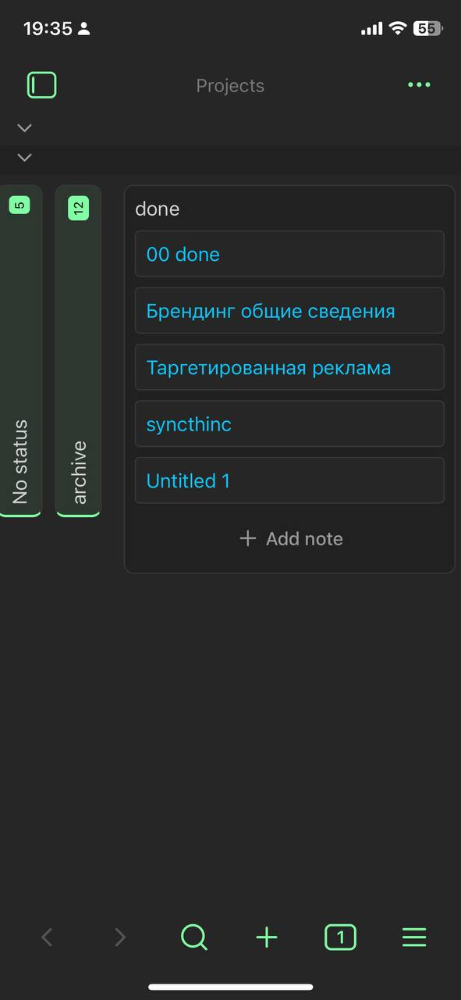

<div align="center">

# 🚀 Projects Plus

**Enhanced project management for Obsidian with advanced features**

[](https://github.com/ParkPavel/obs-projects-plus/actions/workflows/ci.yml)
[](https://github.com/ParkPavel/obs-projects-plus/actions/workflows/release.yml)
[](https://github.com/ParkPavel)
[](https://parkpavel.github.io/park-pavel/)
[](LICENSE)
[](https://obsidian.md)


</div>

---

## ✨ Overview

**Projects Plus** is a community-maintained fork of the original [Obsidian Projects](https://github.com/marcusolsson/obsidian-projects) plugin by Marcus Olsson. This enhanced version provides advanced project management features for [Obsidian](https://obsidian.md) with improved performance, stability, and additional customization options.

Perfect for content managers, researchers, and anyone who needs to organize notes into manageable projects. Create drafts, track their status, and schedule publication dates.

## 🌟 Features

### 📱 **Mobile UX (v2.2.0)**
- **DayPopup** - Full-screen day overview with single tap
- **Double Tap** - Instant note creation
- **Larger Day Cells** - +100% height for better touch targets
- **Floating "Today" Button** - Available when toolbar is hidden
- **Toolbar Collapse** - Full collapse with floating toggle buttons
- **No Drag-n-Drop** - Prevents conflicts with touch gestures
- **Note Actions** - Settings, duplicate, delete directly in popup

### 🗓️ **Calendar Zoom Gestures (v2.1.0)**
- **Infinite Scroll** - Smooth navigation through months/weeks
- **Smart Zoom** - Ctrl+scroll for view switching (Month ↔ Week ↔ Day)
- **Pinch-to-zoom** - Touchpad gesture support
- **Date Centering** - Zoom maintains focus on selected date
- **Visual Indicator** - Elegant Apple-style zoom level display

### 📊 **Multiple View Types**
- **📋 Table View** - Spreadsheet-like interface for data management
- **📌 Board View** - Kanban-style project boards
- **📅 Calendar View** - Timeline and scheduling interface
- **🖼️ Gallery View** - Visual card-based layout

### 🔧 **Advanced Configuration**
- **📁 Folder-based Projects** - Create projects from existing folders
- **🏷️ Tag-based Projects** - Organize by tags with hierarchy support
- **🔍 Dataview Integration** - Use Dataview queries for complex filtering
- **📝 Custom Templates** - Configure note templates for each project

### 🌐 **Localization**
- Russian, English, Ukrainian, Chinese (zh-CN)

### ⚡ **Performance & Stability**
- Enhanced performance optimizations
- Improved memory management
- Better error handling and recovery
- Smooth user experience

## 🚀 Quick Start

### Installation via BRAT (Recommended)

1. Install the [BRAT](https://github.com/TfTHacker/obsidian42-brat) plugin
2. Open BRAT settings
3. Add this repository: `ParkPavel/obs-projects-plus`
4. Enable the plugin in Obsidian settings

### Manual Installation

1. Download the latest release from [GitHub Releases](https://github.com/ParkPavel/obs-projects-plus/releases)
2. Extract the files to your vault's `.obsidian/plugins/obs-projects-plus/` folder
3. Enable the plugin in Obsidian settings

### Getting Started

1. Press **Ctrl+P** (or **Cmd+P** on macOS) to open the **Command palette**
2. Select **Projects Plus: Show projects plus**
3. Create your first project by clicking the **+** button

## 📖 Usage Examples

### Creating a Project from Folder

```markdown
1. Right-click on any folder in the File Explorer
2. Select "Create project in folder"
3. Configure your project settings
4. Start organizing your notes!
```

### Using Dataview Queries

```markdown
# Create a project with Dataview query
FROM "Projects/MyProject"
WHERE status != "completed"
SORT file.ctime DESC
```

### Custom Templates

```markdown
# Template for new notes
---
title: "{{title}}"
status: "draft"
created: {{date}}
---

# {{title}}

## Overview
<!-- Add your content here -->

## Tasks
- [ ] Task 1
- [ ] Task 2
```

## 🎨 Screenshots

<div align="center">

### Mini Gallery

<a href="screenshots/Table.png"></a>
<a href="screenshots/board.png"></a>
<a href="screenshots/Calendar.png"></a>
<a href="screenshots/Gallery.png"></a>

<a href="screenshots/Tablemob.jpg"></a>
<a href="screenshots/Boardmob.jpg"></a>
<a href="screenshots/BoardMob2.jpg"></a>
<a href="screenshots/CalendarMob.jpg"></a>
<a href="screenshots/Gallerymob2.jpg"></a>

</div>

## ⚙️ Configuration

### General Settings

| Setting | Description | Default |
|---------|-------------|---------|
| **Project Size Limit** | Maximum number of notes to load | 1000 |
| **Link Behavior** | What happens when clicking links | Open note |
| **Start Week On** | First day of the week | Default |

### Advanced Settings

- **Front Matter Configuration** - Customize YAML handling
- **Template Management** - Set up note templates
- **Command Integration** - Add custom commands
- **Archive Management** - Restore or delete archived projects

## 🤝 Contributing

We welcome contributions! Here's how you can help:

### 🐛 **Bug Reports**
- Use the [Issues](https://github.com/ParkPavel/obs-projects-plus/issues) page
- Provide detailed reproduction steps
- Include Obsidian version and plugin version

### 💡 **Feature Requests**
- Check existing [issues](https://github.com/ParkPavel/obs-projects-plus/issues) first
- Describe the use case and expected behavior
- Consider contributing the implementation

### 🔧 **Development**

```bash
# Clone the repository
git clone https://github.com/ParkPavel/obs-projects-plus.git
cd obs-projects-plus

# Install dependencies
npm install

# Start development
npm run dev

# Build for production
npm run build
```

### 📝 **Translation**
Help us translate the plugin to your language:
1. Fork the repository
2. Add translations to `src/lib/stores/translations/`
3. Update `src/lib/stores/i18n.ts`
4. Submit a pull request

## 🛠️ Development

### Prerequisites
- Node.js 18+
- npm or yarn
- Obsidian with plugin development enabled

### Scripts
```bash
npm run dev          # Start development server
npm run build        # Build for production
npm run test         # Run tests
npm run lint         # Lint code
npm run format       # Format code
```

## 📚 Documentation

- **[User Guide](docs/user-guide-EN.md)** - Complete usage instructions
- **[API Reference](docs/api.md)** - Developer API documentation
- **[Contributing Guide](../docs/CONTRIBUTING.md)** - How to contribute
- **[Release Information](RELEASES-EN.md)** - Version history and news

## 🌟 Community

### 📺 **Videos & Tutorials**

- [How to use Obsidian: Project vs Trello](https://www.youtube.com/watch?v=kWpIz0CJXoE) by [+1creator](https://www.youtube.com/@plus1creator)
- [How To Use Obsidian: Project Management (NEW & IMPROVED!)](https://www.youtube.com/watch?v=tYC7n-sDApU) by [+1creator](https://www.youtube.com/@plus1creator)
- [Obsidian Projects - How To Manage Your Projects in Obsidian](https://youtu.be/aFfREf9IQ7Q?t=452) by [Marco Serafini](https://www.youtube.com/@Marco_Mindstone)

### 📖 **Articles**

- [The Obsidian Projects Plugin: My Secret Weapon for Staying Organized and Focused](https://www.jordanrobison.net/the-obsidian-projects-plugin-my-secret-weapon-for-staying-organized-and-focused/) by [Jordan Robison](https://www.jordanrobison.net/)
- [Obsidian Projects: A Better Way to Manage Text-Based Projects in Obsidian](https://beingpax.medium.com/obsidian-projects-a-better-way-to-manage-text-based-projects-in-obsidian-18c2a991069c) by [Prakash Joshi Pax](https://beingpax.medium.com/)

## 🏆 Roadmap

### 🎯 **Active Development**
- [ ] Enhanced performance optimizations
- [ ] New view types and layouts
- [ ] Advanced filtering and sorting
- [ ] Mobile responsiveness improvements

### 🔮 **Future Plans**
- [ ] Plugin ecosystem integration
- [ ] Advanced automation features
- [ ] Team collaboration tools
- [ ] Cloud synchronization

## 📊 Statistics

<div align="center">


</div>

## 🙏 Credits

This project is a community-maintained fork of the original [Obsidian Projects](https://github.com/marcusolsson/obsidian-projects) plugin by [Marcus Olsson](https://github.com/marcusolsson).

**Original Author:** Marcus Olsson  
**Current Maintainer:** Park Pavel  
**Original Repository:** https://github.com/marcusolsson/obsidian-projects

We thank Marcus for creating the foundation of this excellent plugin.

## 📄 License

Projects Plus is distributed under [Apache License 2.0](LICENSE).

## 🔗 Links

- **🌐 Website:** [parkpavel.github.io](https://parkpavel.github.io/park-pavel/)
- **📧 Contact:** [GitHub Issues](https://github.com/ParkPavel/obs-projects-plus/issues)
- **💬 Discussions:** [GitHub Discussions](https://github.com/ParkPavel/obs-projects-plus/discussions)
- **🐦 Twitter:** [@ParkPavel](https://twitter.com/ParkPavel)

---

<div align="center">

**Made with ❤️ by [Park Pavel](https://parkpavel.github.io/park-pavel/)**

[](https://github.com/ParkPavel)
[](https://parkpavel.github.io/park-pavel/)

</div>