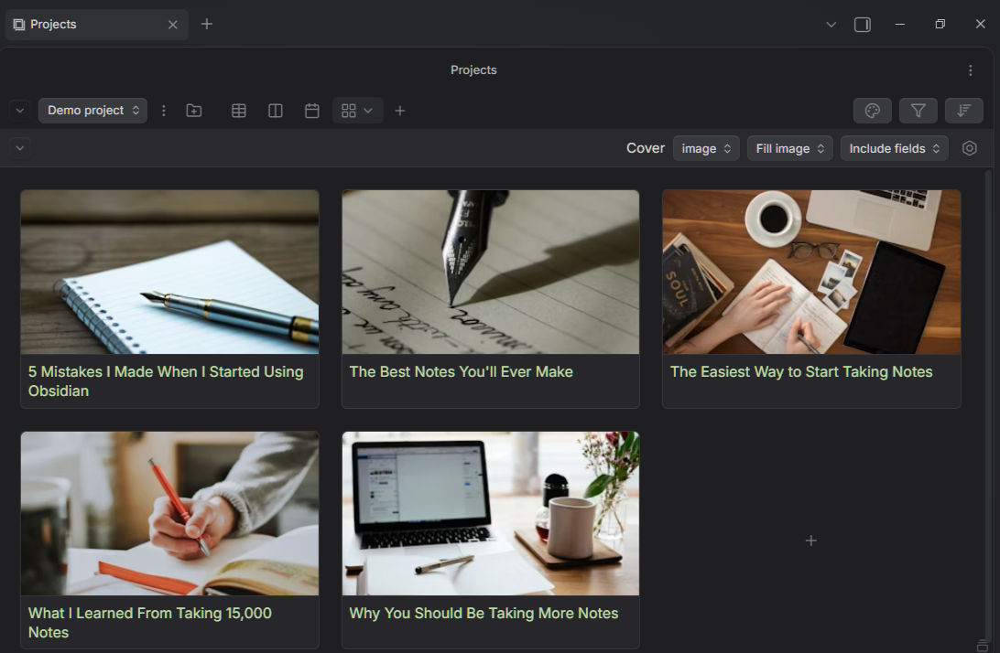
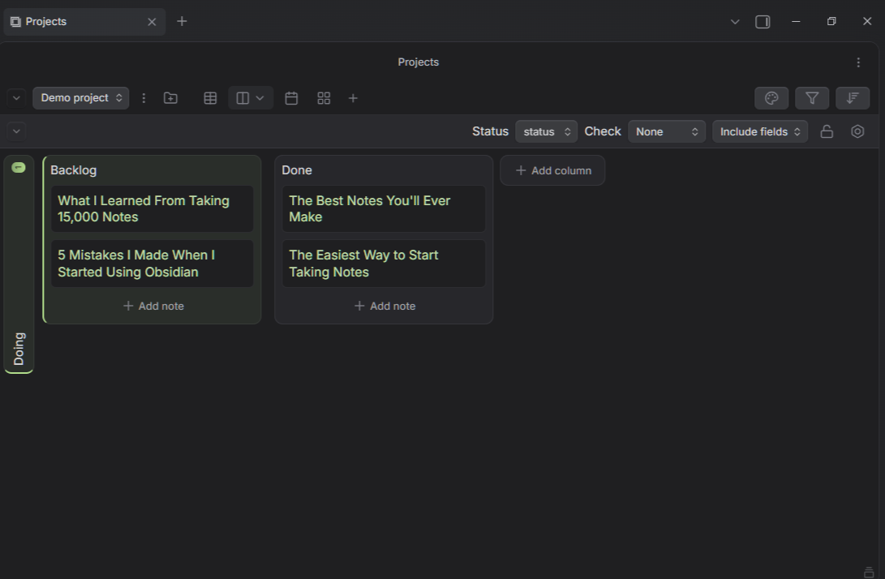
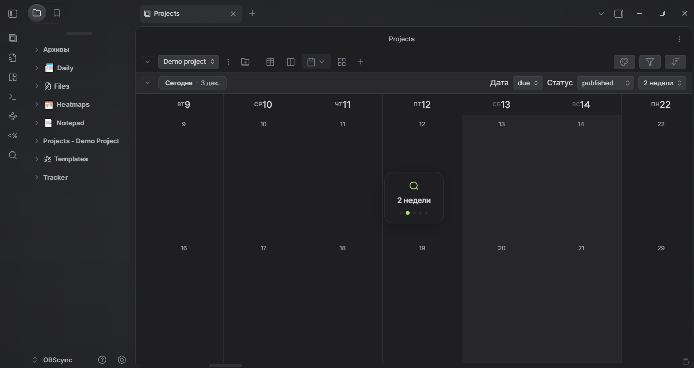
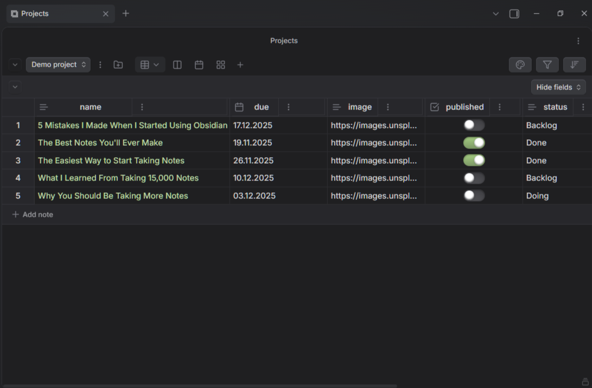

# OBS Projects Plus

<div align="center">


[](https://github.com/Park-Jeong-Gil/OBSv1.0/releases)

**Мощный плагин управления проектами для Obsidian с продвинутыми представлениями и интуитивным интерфейсом**

[English](README-EN.md) | Русский

</div>

---

## 📸 Галерея

<div align="center" style="overflow-x: auto; white-space: nowrap; padding: 20px 0;">
  
  
  
  
  
</div>

---

## ✨ Возможности

### 📱 Мобильный UX (v2.2.0)
- **DayPopup** — полноэкранный обзор дня с одного тапа
- **Двойной тап** — мгновенное создание заметки
- **Увеличенные ячейки** — +100% высота для удобного тапа
- **Плавающая кнопка "Сегодня"** — доступна при скрытом тулбаре
- **Скрытие тулбара** — полное сворачивание с плавающими кнопками
- **Без drag-n-drop** — предотвращение конфликтов с touch-жестами
- **Действия с заметками** — настройки, дублирование, удаление прямо в popup

### 🗓️ Календарь с продвинутыми жестами (v2.1.0)
- **Бесконечный скролл** — плавная навигация по месяцам и неделям (заменяет кнопки Prev/Next)
- **Умный зум** — Ctrl+колесо мыши для переключения между видами:
  - 📅 Месяц → 2 недели → Неделя → 3 дня → День
- **Pinch-to-zoom** — поддержка жестов на тачпаде
- **Центрирование даты** — зум сохраняет фокус на выбранной дате
- **Визуальный индикатор зума** — элегантный индикатор текущего уровня
- **Оптимизированный дизайн** — чистый интерфейс без лишних кнопок

### 📊 Множество представлений
- **Таблица** — классический табличный вид с сортировкой и фильтрацией
- **Доска** — Kanban-стиль для визуального управления задачами
- **Календарь** — временная шкала с поддержкой событий
- **Галерея** — визуальное представление с карточками

### 🎨 Современный дизайн
- Apple-стиль интерфейса с плавными анимациями
- Адаптивный дизайн для различных размеров экрана
- Поддержка светлой и тёмной темы
- Локализация: русский, английский, украинский, китайский

### ⚡ Производительность
- Виртуализация списков для больших наборов данных
- Оптимизированный рендеринг с использованием Svelte
- Эффективная обработка метаданных

---

## 📥 Установка

### Из Community Plugins
1. Откройте **Настройки** → **Сторонние плагины**
2. Отключите **Безопасный режим**
3. Нажмите **Обзор** и найдите "OBS Projects Plus"
4. Нажмите **Установить** и затем **Включить**

### Ручная установка
1. Скачайте последний релиз из [Releases](https://github.com/Park-Jeong-Gil/OBSv1.0/releases)
2. Распакуйте в папку `.obsidian/plugins/obs-projects-plus/`
3. Перезагрузите Obsidian
4. Включите плагин в настройках

---

## 🚀 Быстрый старт

1. **Создайте проект** — используйте команду `OBS Projects Plus: Create Project`
2. **Добавьте заметки** — поместите заметки в папку проекта
3. **Настройте поля** — определите поля в frontmatter заметок
4. **Выберите представление** — переключайтесь между таблицей, доской, календарём и галереей

### Пример frontmatter

```yaml
---
title: Моя задача
status: В работе
priority: Высокий
due: 2024-12-31
tags:
  - важное
  - проект
---
```

---

## ⌨️ Горячие клавиши

| Действие | Клавиши |
|----------|---------|
| Зум календаря | `Ctrl` + Колесо мыши |
| Переход к сегодня | `T` |
| Новая заметка | `Ctrl` + `N` |
| Открыть настройки | `Ctrl` + `,` |

---

## 📖 Документация

- [Руководство пользователя](docs/user-guide.md)
- [API документация](docs/api.md)
- [Руководство по разработке](docs/DEVELOPMENT.md)
- [Журнал изменений](RELEASES.md)

---

## 🔧 Разработка

```bash
# Клонирование репозитория
git clone https://github.com/Park-Jeong-Gil/OBSv1.0.git

# Установка зависимостей
npm install

# Режим разработки
npm run dev

# Сборка
npm run build

# Тестирование
npm test

# Линтинг
npm run lint
```

---

## 🤝 Вклад в проект

Мы приветствуем вклад сообщества! Пожалуйста, прочитайте [CONTRIBUTING.md](CONTRIBUTING.md) перед отправкой pull request.

---

## 📄 Лицензия

[Apache License 2.0](LICENSE) © 2024 Park Jeong-Gil

---

<div align="center">

**Сделано с ❤️ для сообщества Obsidian**

[⭐ Star](https://github.com/Park-Jeong-Gil/OBSv1.0) | [🐛 Issues](https://github.com/Park-Jeong-Gil/OBSv1.0/issues) | [💬 Discussions](https://github.com/Park-Jeong-Gil/OBSv1.0/discussions)

</div>
