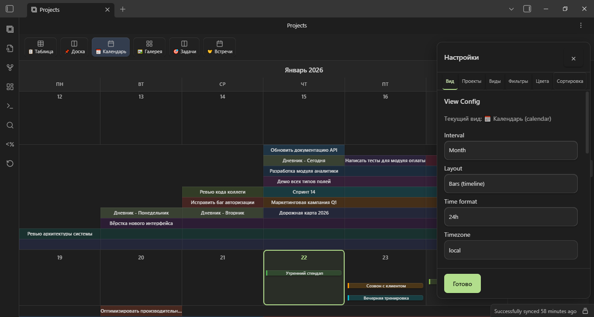
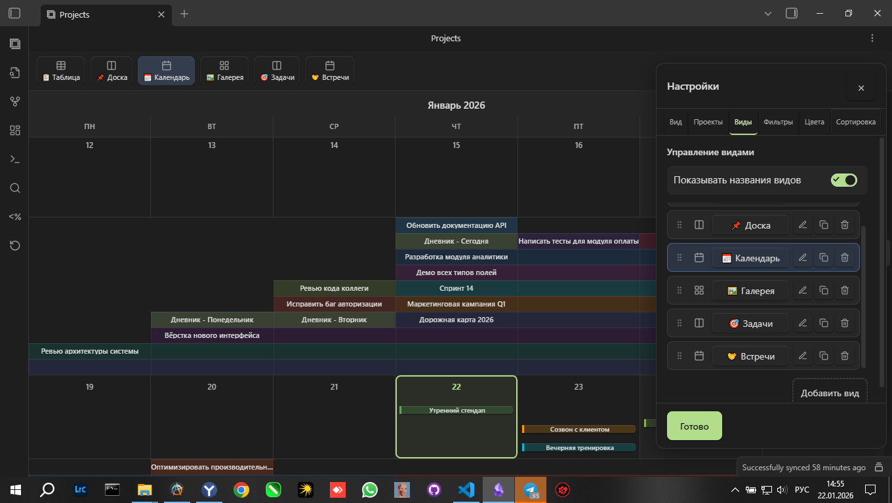
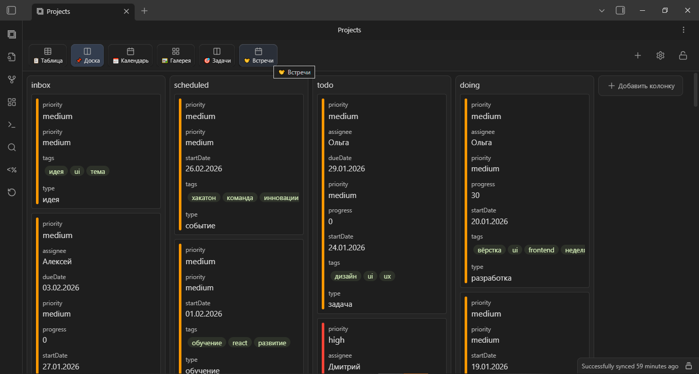
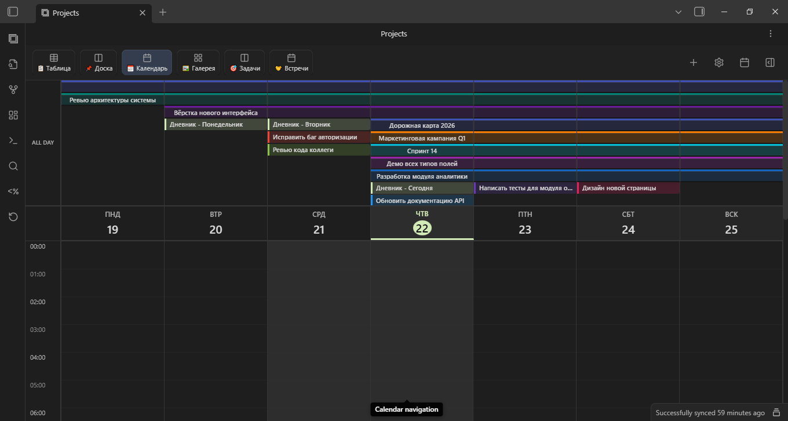
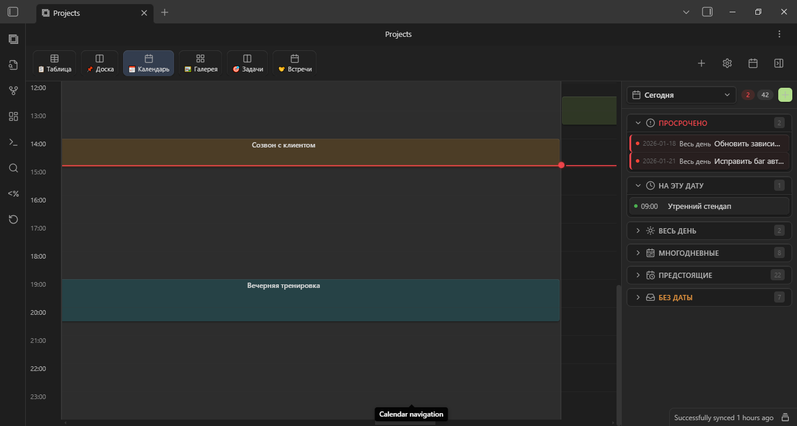
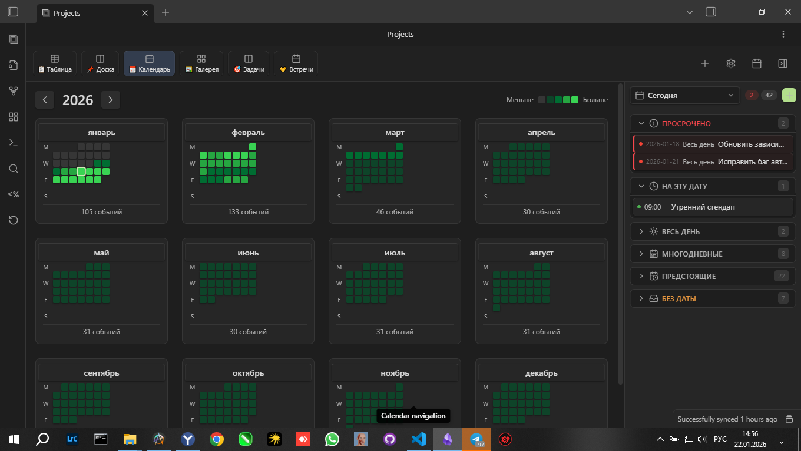

# OBS Projects Plus

<div align="center">


[](https://github.com/ParkPavel/obs-projects-plus/releases)
[](https://t.me/parkpavel_chigon)

**Управление проектами в Obsidian с визуальными представлениями: таблицы, доски, календарь, галерея**

[English](README-EN.md) | Русский

</div>

---

## 🆕 Что нового в v3.0.0

> **Глобальное обновление календаря** — самое масштабное изменение за всю историю плагина

| Возможность | Описание |
|------------|----------|
| 📅 **Timeline view** | События на временной шкале с поддержкой времени |
| 📊 **Multi-day events** | Проекты и события на несколько дней |
| 🎛️ **Центрирование** | Быстрый переход к сегодняшнему дню одним кликом |
| 📱 **Мобильные жесты** | Свайпы, увеличенные области касания |
| 🎯 **Демо-проект** | 35+ заметок при первом запуске |
| 📝 **Автоподсказки** | Умные подсказки для frontmatter полей |

[Полный список изменений →](RELEASES.md)

---

## 📸 Галерея

<table>
  <tr>
    <td align="center" width="50%">
      <br>
      <sub><b>📅 Календарь — месячный вид</b></sub>
    </td>
    <td align="center" width="50%">
      <br>
      <sub><b>📅 Календарь — недельный вид</b></sub>
    </td>
  </tr>
  <tr>
    <td align="center" width="50%">
      <br>
      <sub><b>🕐 Timeline с временной шкалой</b></sub>
    </td>
    <td align="center" width="50%">
      <br>
      <sub><b>📌 Доска — Kanban по статусам</b></sub>
    </td>
  </tr>
  <tr>
    <td align="center" width="50%">
      <br>
      <sub><b>📋 Таблица — полный обзор</b></sub>
    </td>
    <td align="center" width="50%">
      <br>
      <sub><b>🖼️ Галерея — карточки с covers</b></sub>
    </td>
  </tr>
</table>

<details>
<summary><b>📱 Мобильная версия</b></summary>
<br>
<table>
  <tr>
    <td align="center" width="33%">
      <br>
      <sub>Календарь</sub>
    </td>
    <td align="center" width="33%">
      <br>
      <sub>Доска</sub>
    </td>
    <td align="center" width="33%">
      <br>
      <sub>Галерея</sub>
    </td>
  </tr>
</table>
</details>

---

## ✨ Возможности

### 📅 Календарь

Полноценная система планирования прямо в Obsidian:

- **Timeline view** — события отображаются на временной шкале (07:00–22:00)
- **Multi-day events** — задачи и проекты на несколько дней
- **Бесконечный скролл** — навигация между месяцами и неделями
- **Zoom жесты** — Ctrl+колесо или pinch для масштабирования
- **Уровни детализации** — Месяц → 2 недели → Неделя → 3 дня → День
- **Мобильные жесты** — свайпы, двойной тап для создания заметки

### 📊 Представления

| Вид | Назначение |
|-----|------------|
| **Таблица** | Полный обзор с сортировкой и фильтрацией |
| **Доска** | Kanban для визуального управления статусами |
| **Календарь** | Timeline с событиями и временем |
| **Галерея** | Карточки с обложками и превью |

### 📱 Мобильная версия

- Увеличенные области касания
- Touch-оптимизация всех элементов
- Свайп-навигация между периодами
- Адаптивная сетка под любой экран

### 🎨 Интерфейс

- Apple-стиль с плавными анимациями
- Светлая и тёмная темы
- Цветовая кодировка задач
- Локализация: RU, EN, UA, ZH

---

## 📥 Установка

### Community Plugins (рекомендуется)
1. **Настройки** → **Сторонние плагины** → **Обзор**
2. Поиск: `OBS Projects Plus`
3. **Установить** → **Включить**

### Ручная установка
```
Скачать → .obsidian/plugins/obs-projects-plus/ → Перезапуск → Включить
```
[Скачать последний релиз →](https://github.com/ParkPavel/obs-projects-plus/releases)

---

## 🚀 Быстрый старт

1. После установки плагин создаст демо-проект с примерами
2. Изучите структуру заметок и представления
3. Создайте свой проект командой `OBS Projects Plus: Create Project`

### Пример frontmatter

```yaml
---
title: Моя задача
status: В работе
priority: Высокий
startDate: 2025-01-20
endDate: 2025-01-25
startTime: "09:00"
endTime: "18:00"
color: blue
tags: [проект, важное]
---
```

---

## ⌨️ Горячие клавиши

| Действие | Клавиши |
|----------|---------|
| Zoom календаря | `Ctrl` + колесо |
| К сегодня | `T` |
| Новая заметка | `Ctrl` + `N` |

---

## 🗺️ Roadmap

| Функция | Версия | Статус |
|---------|--------|--------|
| 🔄 iCal синхронизация (Google, Apple) | v3.1.0 | 🟡 В разработке |
| 📊 Dashboard view (статистика, трекеры) | v3.2.0 | 🟡 Планируется |

---

## 📖 Документация

- [Руководство пользователя](docs/user-guide.md) — полная документация
- [API](docs/api.md) — для разработчиков
- [История версий](RELEASES.md) — все изменения

---

## 💬 Обратная связь

[](https://t.me/parkpavel_chigon)

Новости, обновления и общение:
- **Telegram**: [@parkpavel_chigon](https://t.me/parkpavel_chigon)
- **GitHub Issues**: [Сообщить о проблеме](https://github.com/ParkPavel/obs-projects-plus/issues)
- **GitHub Discussions**: [Обсуждения](https://github.com/ParkPavel/obs-projects-plus/discussions)

---

## 🤝 Вклад в проект

Мы приветствуем вклад сообщества! [CONTRIBUTING.md](CONTRIBUTING.md)

---

## 📄 Лицензия

[Apache License 2.0](LICENSE) © 2024–2026 Park Pavel

---

<div align="center">

**Сделано с ❤️ для сообщества Obsidian**

[⭐ Star](https://github.com/ParkPavel/obs-projects-plus) • [🐛 Issues](https://github.com/ParkPavel/obs-projects-plus/issues) • [💬 Telegram](https://t.me/parkpavel_chigon)

</div>
