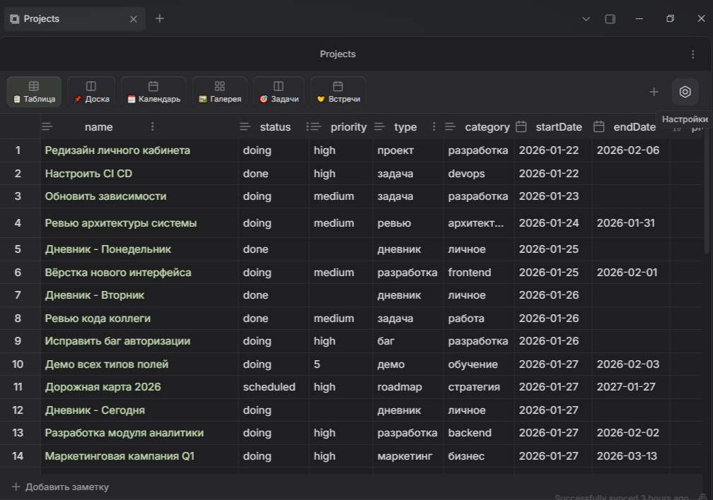
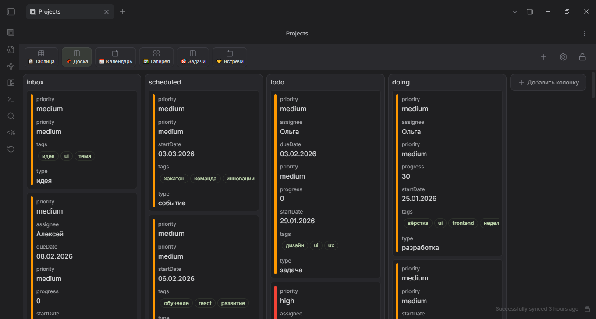
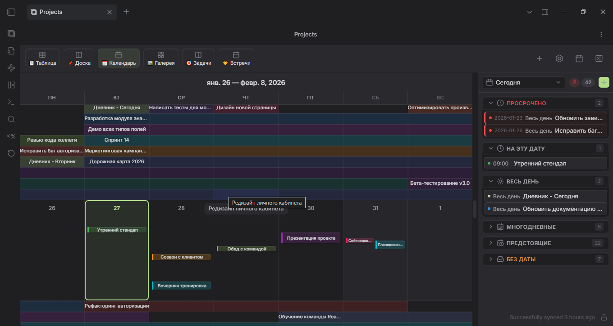
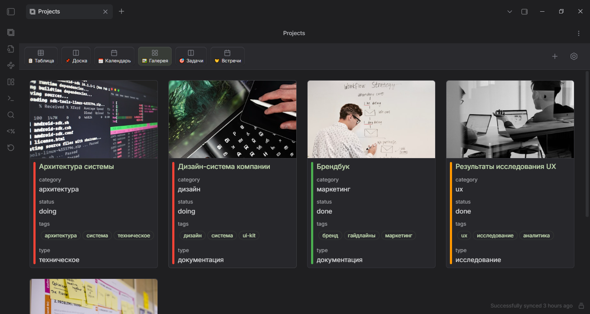
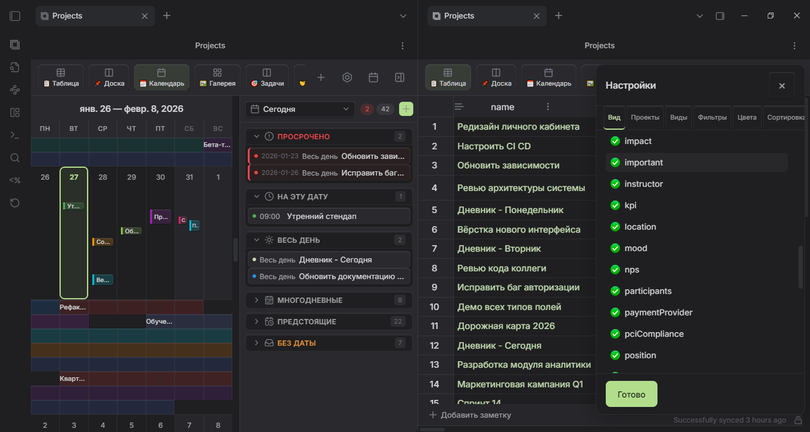
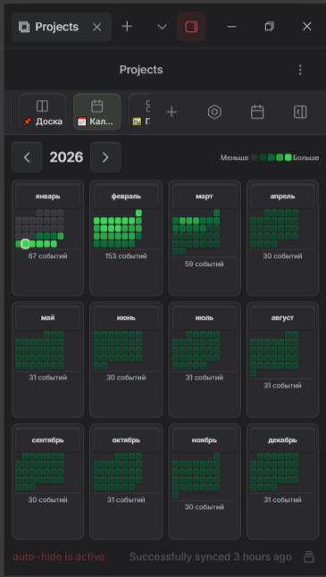
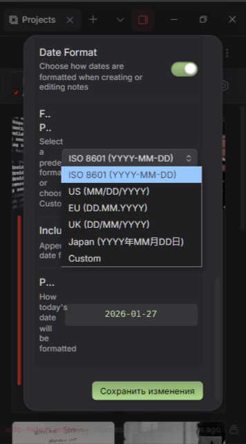
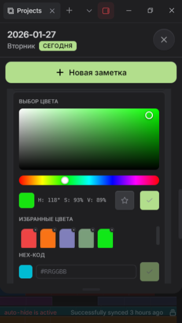
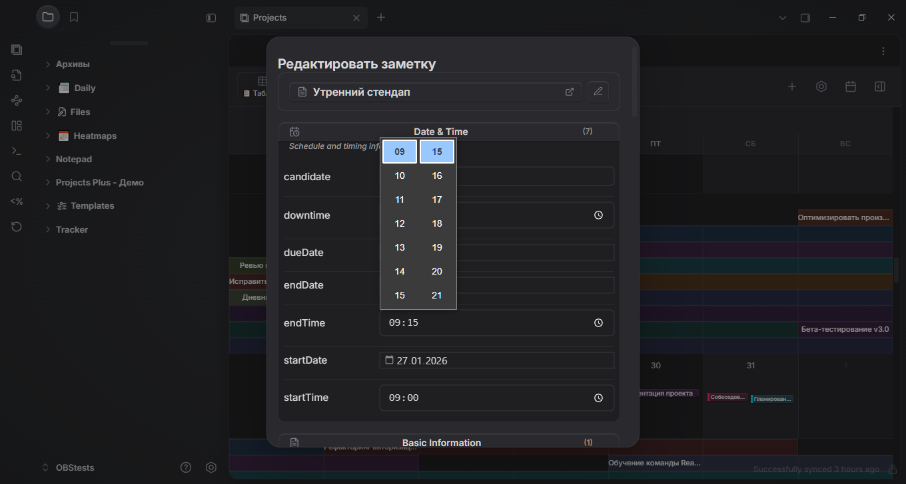

# OBS Projects Plus

<div align="center">


[](https://github.com/ParkPavel/obs-projects-plus/releases)
[](https://t.me/parkpavel_chigon)

**Управление проектами в Obsidian: таблицы, доски, календарь с timeline, галерея**

[English](README-EN.md) | Русский

</div>

---

## Зачем этот плагин?

Obsidian хранит всё в обычных Markdown-файлах. Это удобно для текста, но когда заметок становится десятки или сотни — сложно понять, что и в каком состоянии.

**Projects Plus** превращает папку с заметками в управляемый проект: вы видите все задачи на канбан-доске, все события на календаре, все карточки в галерее — и всё это без экспорта, без облака, прямо в вашем хранилище.

### Кому подойдёт

- **Контент-менеджерам** — отслеживать статус публикаций в таблице и на доске
- **Исследователям** — организовать источники, заметки и дедлайны с фильтрацией
- **Планировщикам** — видеть задачи на timeline-календаре с мультидневными событиями
- **Всем, кто ведёт базу знаний** — когда нужен визуальный обзор, а не список файлов

### Как это работает

1. Вы указываете **папку**, **тег** или **Dataview-запрос** — это "проект"
2. Плагин собирает все подходящие заметки и читает их `frontmatter` (YAML-шапка)
3. Вы выбираете **представление** — таблица, доска, календарь или галерея
4. Редактируете поля прямо в интерфейсе — плагин записывает изменения обратно в файл

Данные **остаются в ваших файлах**. Плагин не создаёт собственную базу данных.

---

## 📸 Галерея

<p align="center">
  
  
  
  
  
</p>
<p align="center">
  
  
  
  
</p>

<details>
<summary align="center"><b>👆 Нажмите для просмотра в полном размере</b></summary>
<p align="center">
  <a href="images/2026-01-27_12-23-33.png"></a>
  <a href="images/2026-01-27_12-23-55.png"></a>
  <a href="images/2026-01-27_12-24-17.png"></a>
  <a href="images/2026-01-27_12-24-35.png"></a>
  <a href="images/2026-01-27_12-26-03.png"></a>
  <a href="images/2026-01-27_12-26-43.png"></a>
  <a href="images/2026-01-27_12-27-29.png"></a>
  <a href="images/2026-01-27_12-29-16.png"></a>
  <a href="images/2026-01-27_12-30-02.png"></a>
</p>
</details>

---

## ✨ Возможности

| Представление | Что делает |
|---------------|------------|
| **Таблица** | Редактирование с сортировкой, фильтрацией, навигацией по ячейкам |
| **Доска** | Kanban — перетаскивание карточек между колонками (статусами) |
| **Календарь** | Timeline 07:00–22:00, мульти-дневные бары, 5 уровней зума (Год → День) |
| **Галерея** | Карточки с обложками и полями из frontmatter |

**Календарь** — полноценный планировщик: `startDate`, `endDate`, `startTime`, `endTime`, поле `color` для цветовой кодировки, бесконечный скролл, мобильные жесты (свайп, pinch-to-zoom, двойной тап для создания заметки).

**Agenda 2.0** — боковая панель календаря с конструктором списков: 42 оператора фильтрации, вложенные AND/OR группы, формулы дат (`today`, `sow`, `eom`, `today+1w`), два режима — визуальный и Advanced (формулы в стиле Google Sheets).

**Три источника данных**: папка, тег, Dataview-запрос. Шаблоны заметок, автосохранение, локализация (RU, EN, UA, ZH-CN).

> Подробнее о горячих клавишах, жестах, шаблонах и настройках — в **[Руководстве пользователя](docs/user-guide.md)**.

---

## 📥 Установка

### BRAT (рекомендуется)
1. Установите [BRAT](https://github.com/TfTHacker/obsidian42-brat)
2. В настройках BRAT добавьте: `ParkPavel/obs-projects-plus`
3. Включите плагин

### Ручная установка
1. Скачайте `main.js`, `manifest.json`, `styles.css` из [Releases](https://github.com/ParkPavel/obs-projects-plus/releases)
2. Поместите в `.obsidian/plugins/obs-projects-plus/`
3. Перезапустите Obsidian → Включите плагин

---

## 🚀 Быстрый старт

1. При первом включении плагин создаёт **демо-проект** (35+ заметок, 6 представлений)
2. `Ctrl/Cmd+P` → *"Projects Plus: Show projects plus"*
3. Попробуйте переключать виды: Таблица → Доска → Календарь → Галерея
4. Создайте свой проект: `Ctrl/Cmd+P` → *"Projects Plus: Create Project"*

```yaml
# Пример frontmatter для заметки проекта
---
title: Моя задача
status: todo
priority: high
startDate: 2026-02-15
endDate: 2026-02-20
startTime: "09:00"
endTime: "18:00"
color: "#4CAF50"
tags: [проект, важное]
---
```

---

## 🗺️ Roadmap

| Приоритет | Функция | Версия | Статус |
|:---------:|---------|--------|--------|
| ✅ | **Agenda 2.0 & Filter System** | v3.0.5 | Выпущено |
| ✅ | **Obsidian Guidelines Compliance** | v3.0.6 | Выпущено |
| 🔥 | **Оптимизация производительности** | v3.0.7 | В разработке |
| 🔥 | **Исправление обнаружения заметок по тегам** | v3.0.7 | В разработке |
| 🥇 | **Drag & Drop + Mobile** | v3.2.0 | Планируется |
| 🥈 | **Database View** | v3.3.0 | Планируется |
| 🥉 | **Calendar Sync** (iCal, Google, CalDAV) | v3.4.0 | Планируется |

---

<details>
<summary><h2>🛠️ Для разработчиков</h2></summary>

### Известные проблемы

| # | Проблема | Приоритет | Комментарий |
|---|----------|:---------:|-------------|
| 1 | Снижение производительности после v3.0.6 | P0 | Замена `document.*` → `activeDocument` и другие compliance-правки увеличили время отклика. Требуется профилирование и оптимизация |
| 2 | Обнаружение заметок по тегам работает некорректно | P0 | Tag-based datasource не находит часть заметок. Требуется исследование и исправление |
| 3 | Дублирование логики команд (`main.ts` + `CommandManager`) | P2 | Риск рассогласования при добавлении новых команд |
| 4 | Fire-and-forget `void` в `ViewApi` записи | P2 | Ошибки I/O при записи проглатываются без уведомления пользователя |

### Custom View API (экспериментальное)

Плагин поддерживает регистрацию **пользовательских представлений** от сторонних плагинов. Это наследие оригинального Obsidian Projects (Marcus Olsson).

**Как это работает**: при загрузке Projects Plus перебирает все включённые плагины и ищет метод `onRegisterProjectView`. Если метод найден — плагин вызывает его и регистрирует возвращённый view рядом со встроенными (Table, Board, Calendar, Gallery).

```typescript
// В вашем плагине (plugin.ts):
import { Plugin } from "obsidian";
import type { ProjectView, ProjectViewProps, DataQueryResult } from "obsidian-projects-types";

class MyCustomView extends ProjectView {
  getViewType(): string { return "my-view"; }
  getDisplayName(): string { return "My View"; }
  getIcon(): string { return "layout-grid"; }

  onOpen({ contentEl }: ProjectViewProps) {
    contentEl.createEl("h2", { text: "My Custom View" });
  }

  onData({ data }: DataQueryResult) {
    // data.fields — схема, data.records — заметки
  }

  onClose() { /* cleanup */ }
}

export default class MyPlugin extends Plugin {
  onRegisterProjectView = () => new MyCustomView();
}
```

Установите типы: `npm install --save-dev obsidian-projects-types`

> ⚠️ **API экспериментальное** и может измениться без предупреждения. Подробнее: [obsidian-projects-types/README](obsidian-projects-types/README.md)

### 📣 Голосование контрибьюторов: Svelte 3 → 5

Svelte — **компилятор**, не runtime. В `main.js` нет Svelte-кода. CVE компилятора не затрагивают плагин, Obsidian не проверяет версию Svelte.

**За**: runes DX, экосистема, контрибьюторы. **Против**: ~50+ файлов, ломающее API, нулевое влияние на пользователя.

> [Проголосовать](https://github.com/ParkPavel/obs-projects-plus/discussions) или открыть Issue.

### Разработка

```bash
git clone https://github.com/ParkPavel/obs-projects-plus.git
cd obs-projects-plus
npm ci
npm run dev       # esbuild watch mode
npm run build     # tsc + esbuild production
npm run test      # Jest (291 тест, 16 suites)
npm run lint      # ESLint + eslint-plugin-obsidianmd (23 правила)
npm run format    # Prettier
```

Подробнее: [CONTRIBUTING.md](CONTRIBUTING.md) • [CODE_STANDARDS.md](docs/CODE_STANDARDS.md)

</details>

---

## 📖 Документация

| Документ | Описание |
|----------|----------|
| [Руководство пользователя (RU)](docs/user-guide.md) | Горячие клавиши, жесты, шаблоны, настройки |
| [User Guide (EN)](docs/user-guide-EN.md) | Full instructions in English |
| [Custom View API](obsidian-projects-types/README.md) | Регистрация своих view из других плагинов |
| [История версий](RELEASES.md) | Все релизы |
| [CHANGELOG](CHANGELOG.md) | Keep a Changelog формат |
| [Архитектура фильтров](docs/architecture-filters.md) | Спецификация движка |
| [Drag & Drop](docs/architecture-drag-drop.md) | Спецификация для контрибьюторов |
| [Database View](docs/architecture-database-view.md) | Концептуальный документ |

---

## 💬 Обратная связь

- **Telegram**: [@parkpavel_chigon](https://t.me/parkpavel_chigon)
- **GitHub Issues**: [Сообщить о проблеме](https://github.com/ParkPavel/obs-projects-plus/issues)
- **GitHub Discussions**: [Обсуждения](https://github.com/ParkPavel/obs-projects-plus/discussions)

---

## 🙏 Благодарности

Форк оригинального [Obsidian Projects](https://github.com/marcusolsson/obsidian-projects) от [Marcus Olsson](https://github.com/marcusolsson).  
Текущий мейнтейнер: **Park Pavel**

## 📄 Лицензия

[Apache License 2.0](LICENSE) © 2024–2026 Park Pavel

---

<div align="center">

**Сделано с ❤️ для сообщества Obsidian**

[⭐ Star](https://github.com/ParkPavel/obs-projects-plus) • [🐛 Issues](https://github.com/ParkPavel/obs-projects-plus/issues) • [💬 Telegram](https://t.me/parkpavel_chigon)

</div>
