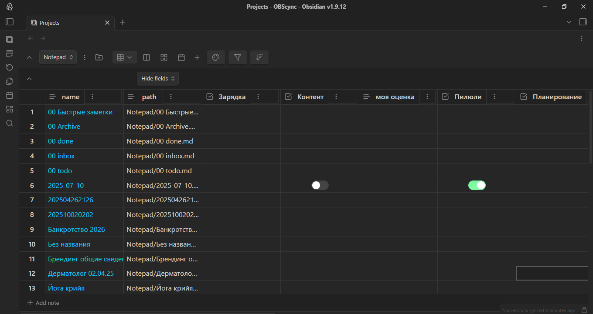
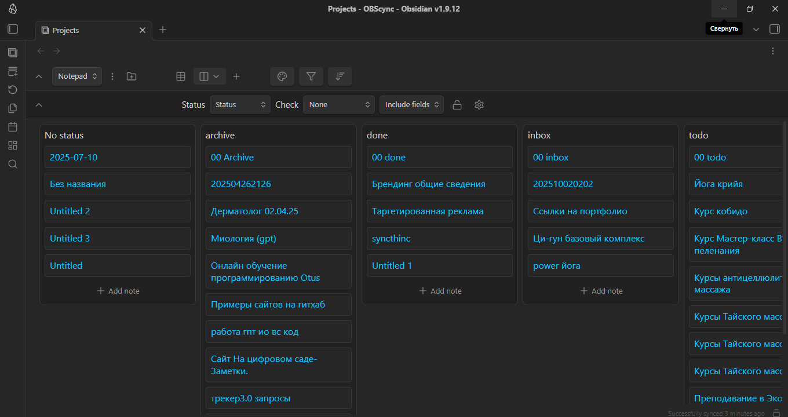
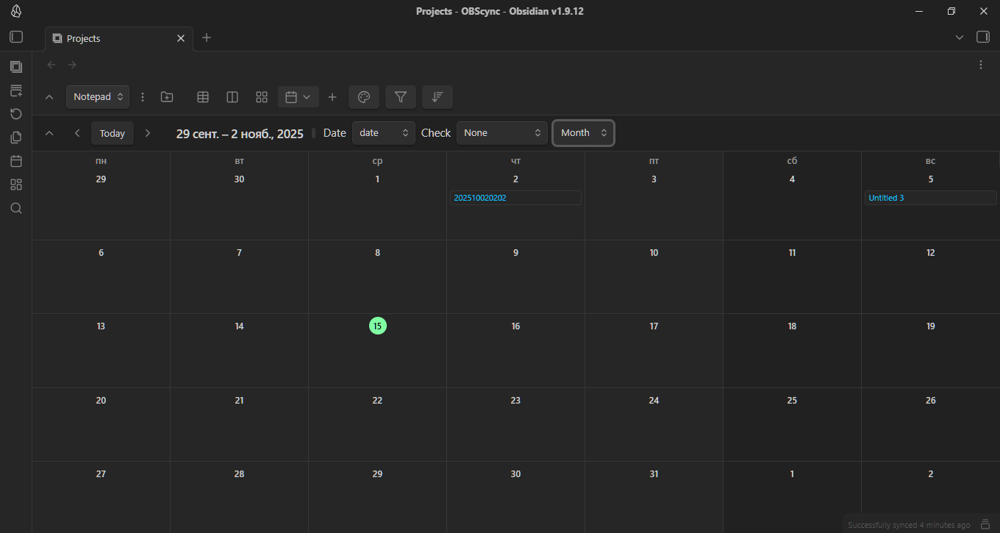
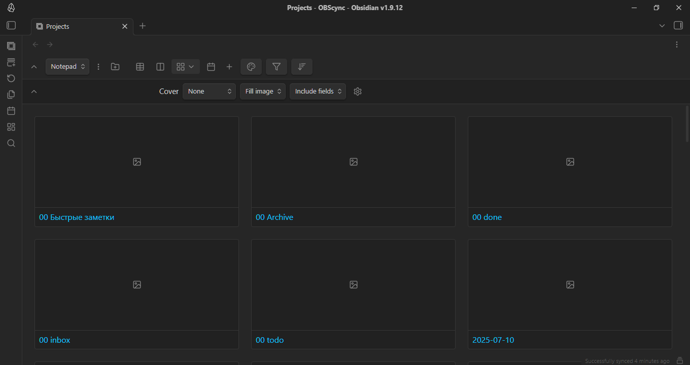
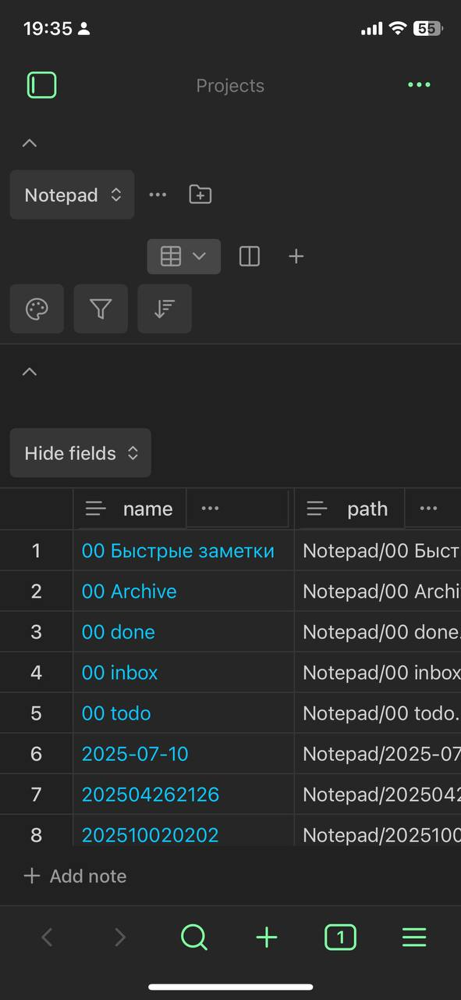
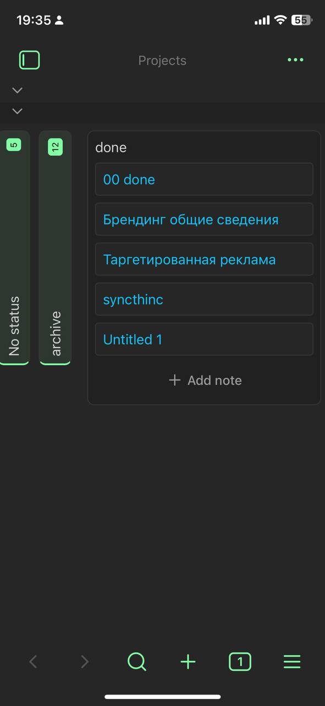
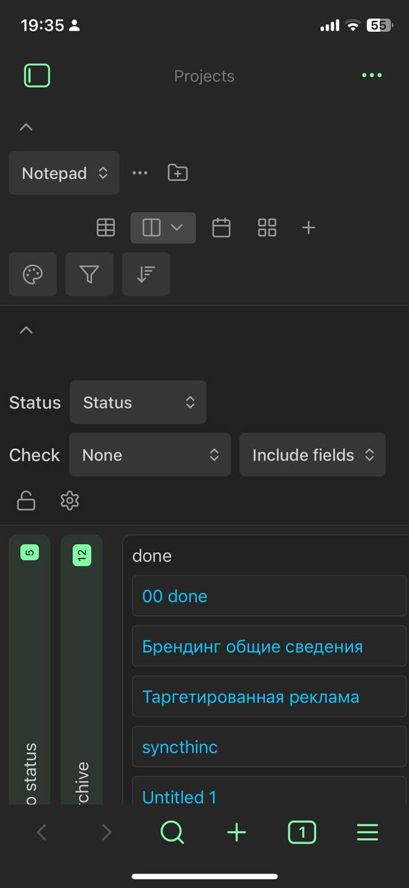
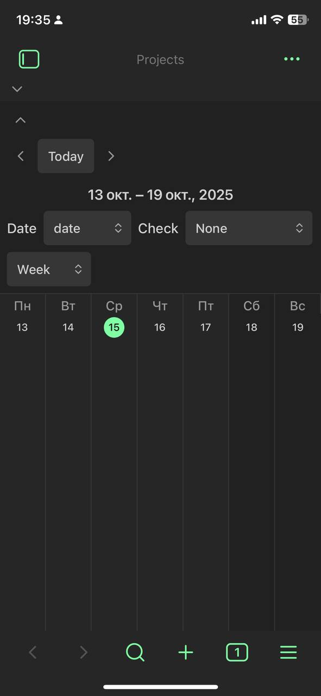
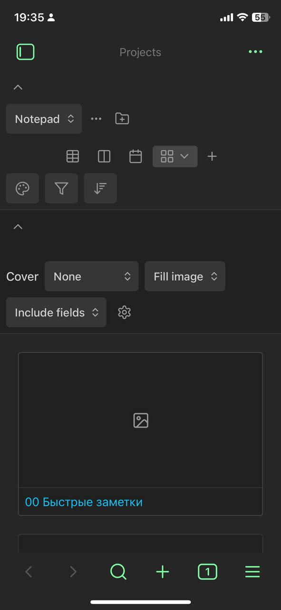

<div align="center">

# 🚀 Projects Plus

**Улучшенное управление проектами для Obsidian с расширенными возможностями**

[](https://github.com/ParkPavel/obs-projects-plus/actions/workflows/ci.yml)
[](https://github.com/ParkPavel/obs-projects-plus/actions/workflows/release.yml)
[](https://github.com/ParkPavel)
[](https://parkpavel.github.io/park-pavel/)
[](LICENSE)
[](https://obsidian.md)

</div>

---

## ✨ Обзор

**Projects Plus** — это поддерживаемый сообществом форк оригинального плагина [Obsidian Projects](https://github.com/marcusolsson/obsidian-projects) от Marcus Olsson. Данная улучшенная версия предоставляет расширенные возможности управления проектами для [Obsidian](https://obsidian.md) с повышенной производительностью, стабильностью и дополнительными опциями настройки.

Идеально подходит для контент-менеджеров, исследователей и всех, кому необходимо организовывать заметки в управляемые проекты. Создавайте черновики, отслеживайте их статус и планируйте даты публикации.

## 🌟 Возможности

### 📊 **Множественные типы представлений**
- **📋 Табличное представление** - Интерфейс в стиле электронной таблицы для управления данными
- **📌 Доска** - Проектные доски в стиле Kanban
- **📅 Календарное представление** - Интерфейс временной шкалы и планирования
- **🖼️ Галерея** - Визуальное представление на основе карточек

### 🔧 **Расширенная настройка**
- **📁 Проекты на основе папок** - Создание проектов из существующих папок
- **🏷️ Проекты на основе тегов** - Организация по тегам с поддержкой иерархии
- **🔍 Интеграция с Dataview** - Использование запросов Dataview для сложной фильтрации
- **📝 Пользовательские шаблоны** - Настройка шаблонов заметок для каждого проекта


### ⚡ **Производительность и стабильность**
- Улучшенные оптимизации производительности
- Улучшенное управление памятью
- Лучшая обработка ошибок и восстановление
- Плавный пользовательский опыт

## 🚀 Быстрый старт

### Установка через BRAT (Рекомендуется)

1. Установите плагин [BRAT](https://github.com/TfTHacker/obsidian42-brat)
2. Откройте настройки BRAT
3. Добавьте этот репозиторий: `ParkPavel/obs-projects-plus`
4. Включите плагин в настройках Obsidian

### Ручная установка

1. Скачайте последний релиз из [GitHub Releases](https://github.com/ParkPavel/obs-projects-plus/releases)
2. Извлеките файлы в папку `.obsidian/plugins/obs-projects-plus/` вашего хранилища
3. Включите плагин в настройках Obsidian

### Начало работы

1. Нажмите **Ctrl+P** (или **Cmd+P** на macOS) для открытия **палитры команд**
2. Выберите **Projects Plus: Show projects plus**
3. Создайте ваш первый проект, нажав кнопку **+**

---

## 📢 Важное (внутренние отчёты)

Некоторая подробная внутренняя аналитика и отчёты по состоянию кода были сгенерированы во время аудита (внутренние артефакты). Эти материалы предназначены для разработчиков и содержат технические детали, которые не нужны конечным пользователям.

Вся внутренняя документация перенесена в папку `internal_docs/`. Публичная документация оставлена короткой и понятной — если вы разработчик, откройте `internal_docs/` в репозитории для подробных отчётов.


## 📖 Примеры использования

### Создание проекта из папки

```markdown
1. Щелкните правой кнопкой мыши по любой папке в проводнике файлов
2. Выберите "Создать проект в папке"
3. Настройте параметры вашего проекта
4. Начните организовывать ваши заметки!
```

### Использование запросов Dataview

```markdown
# Создание проекта с запросом Dataview
FROM "Projects/MyProject"
WHERE status != "completed"
SORT file.ctime DESC
```

### Пользовательские шаблоны

```markdown
# Шаблон для новых заметок
---
title: "{{title}}"
status: "draft"
created: {{date}}
---

# {{title}}

## Обзор
<!-- Добавьте ваш контент здесь -->

## Задачи
- [ ] Задача 1
- [ ] Задача 2
```

## 🎨 Скриншоты

<div align="center">

### Мини галерея

<a href="screenshots/Table.png"></a>
<a href="screenshots/board.png"></a>
<a href="screenshots/Calendar.png"></a>
<a href="screenshots/Gallery.png"></a>

<a href="screenshots/Tablemob.jpg"></a>
<a href="screenshots/Boardmob.jpg"></a>
<a href="screenshots/BoardMob2.jpg"></a>
<a href="screenshots/CalendarMob.jpg"></a>
<a href="screenshots/Gallerymob2.jpg"></a>

</div>

## ⚙️ Конфигурация

### Общие настройки

| Настройка | Описание | По умолчанию |
|-----------|----------|--------------|
| **Лимит размера проекта** | Максимальное количество загружаемых заметок | 1000 |
| **Поведение ссылок** | Что происходит при нажатии на ссылки | Открыть заметку |
| **Начало недели** | Первый день недели | По умолчанию |

### Расширенные настройки

- **Конфигурация Front Matter** - Настройка работы с YAML
- **Управление шаблонами** - Настройка шаблонов заметок
- **Интеграция команд** - Добавление пользовательских команд
- **Управление архивами** - Восстановление или удаление архивных проектов

## 🤝 Участие в разработке

Мы приветствуем вклад в развитие проекта! Вот как вы можете помочь:

### 🐛 **Сообщения об ошибках**
- Используйте страницу [Issues](https://github.com/ParkPavel/obs-projects-plus/issues)
- Предоставьте подробные шаги для воспроизведения
- Укажите версию Obsidian и версию плагина

### 💡 **Запросы новых функций**
- Сначала проверьте существующие [проблемы](https://github.com/ParkPavel/obs-projects-plus/issues)
- Опишите вариант использования и ожидаемое поведение
- Рассмотрите возможность внесения собственной реализации

### 🔧 **Разработка**

```bash
# Клонирование репозитория
git clone https://github.com/ParkPavel/obs-projects-plus.git
cd obs-projects-plus

# Установка зависимостей
npm install

# Начало разработки
npm run dev

# Сборка для продакшена
npm run build
```

### 📝 **Перевод**
Помогите нам перевести плагин на ваш язык:
1. Сделайте форк репозитория
2. Добавьте переводы в `src/lib/stores/translations/`
3. Обновите `src/lib/stores/i18n.ts`
4. Отправьте pull request

## 🛠️ Разработка

### Необходимые условия
- Node.js 18+
- npm или yarn
- Obsidian с включенной разработкой плагинов

### Скрипты
```bash
npm run dev          # Запуск сервера разработки
npm run build        # Сборка для продакшена
npm run test         # Запуск тестов
npm run lint         # Проверка кода
npm run format       # Форматирование кода
```

## 📚 Документация

- **[Руководство пользователя](docs/user-guide.md)** - Полные инструкции по использованию
- **[Справочник API](docs/api-ru.md)** - Документация API для разработчиков
- **[Руководство по участию](../docs/CONTRIBUTING.md)** - Как внести вклад
- **[Информация о релизах](RELEASES.md)** - История версий и новости

## 🌟 Сообщество

### 📺 **Видео и уроки**

- [How to use Obsidian: Project vs Trello](https://www.youtube.com/watch?v=kWpIz0CJXoE) от [+1creator](https://www.youtube.com/@plus1creator)
- [How To Use Obsidian: Project Management (NEW & IMPROVED!)](https://www.youtube.com/watch?v=tYC7n-sDApU) от [+1creator](https://www.youtube.com/@plus1creator)
- [Obsidian Projects - How To Manage Your Projects in Obsidian](https://youtu.be/aFfREf9IQ7Q?t=452) от [Marco Serafini](https://www.youtube.com/@Marco_Mindstone)

### 📖 **Статьи**

- [The Obsidian Projects Plugin: My Secret Weapon for Staying Organized and Focused](https://www.jordanrobison.net/the-obsidian-projects-plugin-my-secret-weapon-for-staying-organized-and-focused/) от [Jordan Robison](https://www.jordanrobison.net/)
- [Obsidian Projects: A Better Way to Manage Text-Based Projects in Obsidian](https://beingpax.medium.com/obsidian-projects-a-better-way-to-manage-text-based-projects-in-obsidian-18c2a991069c) от [Prakash Joshi Pax](https://beingpax.medium.com/)

## 🏆 Дорожная карта

### 🎯 **Текущий фокус**
- Поддержание стабильности и производительности
- Исправление багов и улучшение UX
- Поддержка совместимости с Obsidian

### 🔄 **Процесс разработки**
- Стабильные релизы по мере накопления улучшений
- Приоритет на стабильность и производительность
- Сообщество-ориентированная разработка

## 📊 Статистика

<div align="center">


</div>

## 🙏 Благодарности

Этот проект является поддерживаемым сообществом форком оригинального плагина [Obsidian Projects](https://github.com/marcusolsson/obsidian-projects) от [Marcus Olsson](https://github.com/marcusolsson).

**Оригинальный автор:** Marcus Olsson  
**Текущий сопровождающий:** Park Pavel  
**Оригинальный репозиторий:** https://github.com/marcusolsson/obsidian-projects

Мы благодарим Marcus за создание основы этого отличного плагина.

## 📄 Лицензия

Projects Plus распространяется под [Apache License 2.0](LICENSE).

## 🔗 Ссылки

- **🌐 Веб-сайт:** [parkpavel.github.io](https://parkpavel.github.io/park-pavel/)
- **📧 Контакты:** [GitHub Issues](https://github.com/ParkPavel/obs-projects-plus/issues)
- **💬 Обсуждения:** [GitHub Discussions](https://github.com/ParkPavel/obs-projects-plus/discussions)
- **🐦 Twitter:** [@ParkPavel](https://twitter.com/ParkPavel)

---

<div align="center">

**Создано с ❤️ от [Park Pavel](https://parkpavel.github.io/park-pavel/)**

[](https://github.com/ParkPavel)
[](https://parkpavel.github.io/park-pavel/)

</div>