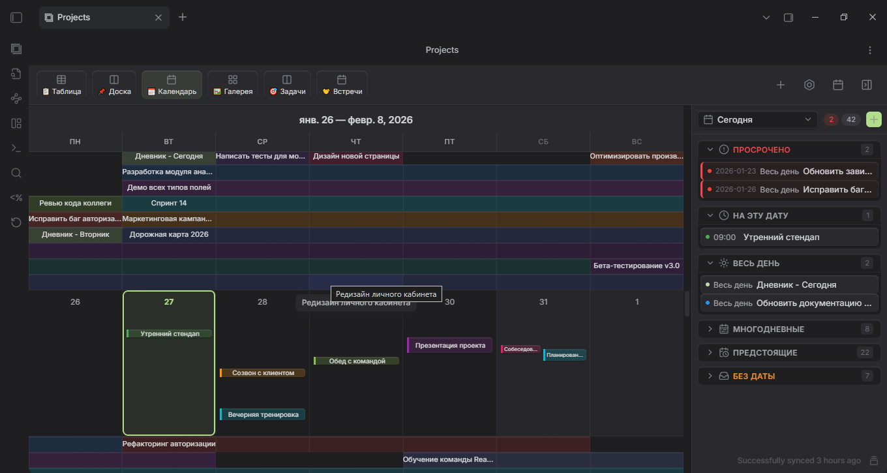

# Projects Plus

[English](README-EN.md) · [Руководство пользователя](docs/user-guide.md) · [Документация](docs/README.md)

Projects Plus помогает работать с заметками Obsidian как с проектом: просматривать записи в таблице, распределять их по колонкам, планировать события в календаре и собирать обзор на Dashboard.

Каждая запись остаётся Markdown-файлом. Поля, например статус, дата и исполнитель, хранятся в свойствах заметки — YAML-блоке в начале файла. Изменение обычного редактируемого поля в плагине записывается в заметку.

## Что можно сделать

| Задача | Инструмент |
| --- | --- |
| Сравнить записи и изменить их свойства | Таблица в блоке Dashboard |
| Распределить задачи по статусам | Доска с перетаскиванием карточек |
| Посмотреть встречи и сроки | Календарь с обзором от года до дня |
| Просматривать материалы по обложкам | Галерея |
| Объединить данные, графики и показатели | Dashboard с настраиваемыми блоками |
| Считать итоги по связанным записям | Свёртки через связь и обратные — «записи, которые ссылаются сюда» |
| Сравнить показатели разных проектов | Графики с несколькими сериями, данными другого проекта и второй осью |
| Выбрать нужные заметки | Папка, тег, встроенный запрос с фильтром или Dataview |



Иллюстрация показывает один из вариантов интерфейса; оформление установленной версии может отличаться.

## Установка

Текущая версия — **3.6.2**: код проходит автоматическое ревью каталога сообщества Obsidian; 3.6.1 принесла новое демо из трёх связанных проектов. Первая версия в формате каталога сообщества Obsidian — 3.6.0. Готовые сборки лежат в [GitHub Releases](https://github.com/ParkPavel/obs-projects-plus/releases); нужен Obsidian 1.8.7 или новее, на компьютере или телефоне. Что изменилось — в [истории изменений](CHANGELOG-RU.md).

1. Выберите релиз и скачайте из него **все три файла**: `main.js`, `manifest.json` и `styles.css`.
2. Создайте в своём хранилище папку `.obsidian/plugins/obs-projects-plus/` и поместите туда файлы.
3. Перезапустите Obsidian и включите **Projects Plus** в настройках сторонних плагинов.

При обновлении заменяйте эти три файла одной сборкой. Сохраните `data.json`: в нём находятся настройки ваших проектов и представлений.

## Первый проект

1. Создайте в хранилище папку `Projects`, а в ней заметку `First task.md`:

   ```yaml
   ---
   title: Первый шаг
   status: todo
   startDate: 2026-09-15
   ---
   ```

2. Откройте палитру команд Obsidian и найдите **Создать новый проект плюс**.
3. Задайте имя проекта, выберите источник **Папка** и путь `Projects`.
4. Откройте проект командой **Показать проекты плюс**. Добавьте представление через кнопку добавления представления; для таблицы используйте блок данных на Dashboard.
5. Измените `status` у записи и откройте Markdown-файл: значение должно сохраниться в свойствах заметки.

Для знакомства на готовых данных используйте команду **Создать демо-проект**: она создаёт три связанных проекта — массажный кабинет, трекер самочувствия и личный бюджет, — данные которых перетекают между ними. Её же предлагают окно приветствия и пустой экран проектов. Есть и отдельное [демо-хранилище](demo-vault/README.md).

## Куда дальше

- [Руководство пользователя](docs/user-guide.md): источники, представления, фильтры, шаблоны и решение проблем.
- [Шаблоны заметок](templates/README.md): примеры для задач, встреч и обзоров.
- [История изменений](CHANGELOG-RU.md) и [сообщения об ошибках](https://github.com/ParkPavel/obs-projects-plus/issues).
- [Участие в разработке](CONTRIBUTING.md) и [API пользовательских представлений](docs/api.md).

Разработка проекта ведётся через [Claudex](https://github.com/ParkPavel/claudex). Настройки и инструкции для ИИ поддерживаются в том отдельном проекте.

Projects Plus основан на [Obsidian Projects](https://github.com/marcusolsson/obsidian-projects) Маркуса Олссона. Текущий сопровождающий — Park Pavel. Лицензия: [Apache 2.0](https://github.com/ParkPavel/obs-projects-plus/blob/main/LICENSE); сведения об авторстве — [NOTICE](https://github.com/ParkPavel/obs-projects-plus/blob/main/NOTICE).
