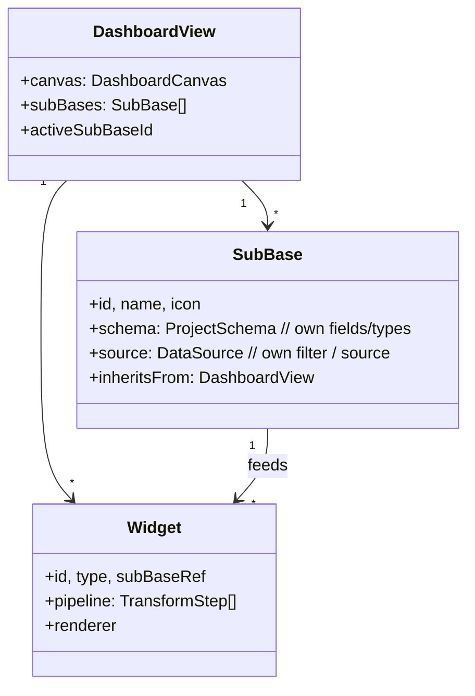

# Architecture v4.0 — Target Design

> **Status**: NORMATIVE design for v4.0 refactor.
> **Authoritative as of**: 2026-05-03 (Refactoring Session v4.0 / Phase 2).
> **Predecessor**: `docs/archive/architecture-engine-v2.md`, `docs/archive/architecture-database-view.md`.
> **Constraints**: Test count must NOT decrease (≥1176). Atomic rename "Database View → Dashboard View". Public API stable.

---

## 0. Goals

1. **One DataEngine** — collapse dual filter / triple aggregation / triple wiki-link into a single contractual layer.
2. **Dashboard View** as first-class top-level abstraction (renamed from "Database View"); **SubBase** as schema-bearing partition primitive.
3. **Matryoshka Relations** — first-class row↔row and property↔property relations across SubBases, with deterministic inverse index.
4. **YAML Frontmatter Layer** — file-system writer/reader contract that replaces ad-hoc Obsidian Properties calls and is the only place that mutates frontmatter.
5. **Unified Color System** — single `ColorToken` source of truth; persistence migrated; all UI consumes `lib/colors/`.
6. **Table View Rebuild Spec** — strict CSS Grid + virtualization, 100% inside `Database/widgets/DataTable/`; legacy `views/Table/` deprecated.

Every section below has: contract → consumers → migration → acceptance criteria.

---

## 1. Unified DataEngine

### 1.1 Architectural diagram

```mermaid
flowchart TD
    FS[Vault FS<br/>files + frontmatter] --> DSrc[DataSource<br/>folder/tag/dataview]
    DSrc -->|raw records| Frame[DataFrame v2]
    Frame --> Pipeline[TransformPipeline]
    subgraph Pipeline
      Filter[FilterStep<br/>FilterIR]
      Sort[SortStep]
      Group[GroupStep]
      Compute[ComputeStep<br/>FormulaIR + RollupIR]
      Aggregate[AggregateStep<br/>aggregate&#40;&#41; kernel]
    end
    Filter --> Sort --> Group --> Compute --> Aggregate
    Aggregate --> Out[ProjectedFrame]
    Out --> Views{Views}
    Views --> Dashboard[Dashboard View]
    Views --> Calendar
    Views --> Board
    Views --> Gallery
    Views --> Table[Legacy Table<br/>deprecated]
```



### 1.2 Contracts

```ts
// src/lib/engine/contracts.ts (NEW, Layer 0)

export interface FilterIR {
  conjunction: "and" | "or";
  conditions: FilterCondition[];
  groups: FilterIR[];
}
export interface FilterCondition {
  field: string;
  op: FilterOperator;       // canonical 30-op set
  value?: DataValue;
  enabled: boolean;
}

export type AggregateFn =
  | "sum" | "avg" | "min" | "max" | "median"
  | "count" | "count_unique" | "count_empty" | "count_not_empty"
  | "first" | "last"
  | "list" | "list_unique"
  | "range" | "earliest" | "latest";

export interface RollupIR {
  relationField: string;
  targetField: string;
  fn: AggregateFn;       // function and Notion-mode are derived from fn ↔ mode pair
  mode: RollupModeId;    // R2.1b invariant: getRollupMode(mode).fn === fn
  separator?: string;
}

export interface FormulaIR {
  ast: FormulaNode;       // existing parser AST
  expectedType?: DataFieldType;
}

export interface TransformStep {
  kind: "filter" | "sort" | "group" | "compute" | "aggregate";
  payload: FilterIR | SortIR | GroupIR | ComputeIR | AggregateIR;
}

export interface DataEngineRequest {
  source: DataSource;
  schema: ProjectSchema;
  steps: TransformStep[];
  cacheKey?: string;
}
export interface DataEngineResult {
  frame: DataFrame;
  diagnostics: EngineDiagnostic[];   // warnings, soft errors
  meta: { fromCache: boolean; durationMs: number };
}
```

**Invariant enforcement**:
- `RollupIR.fn ↔ mode` validated by `assertRollupInvariant(rollup)`; settings migration fills missing `mode` from `fn`.
- `FilterCondition.value` for negative ops (`is-not`, `does-not-contain`) returns `true` when field is undefined (R2.1c).

### 1.3 Single evaluators

| Concern | Single source of truth | Replaces |
|---|---|---|
| Filter evaluation | `lib/engine/filterEvaluator.ts::evaluateFilter(record, ir, schema)` | `lib/datasources/filterFunctions.ts` (kept as thin wrapper) + inline switch in `transformExecutor.executeFilter` |
| Aggregation | `lib/engine/aggregate.ts::aggregate(values, fn, opts)` (moved from `Database/engine/rollup.ts`) | `Database/engine/aggregation.ts` local kernels + `formulaEngine.ts::SUM/AVG/...` inline impl |
| Wiki-link parsing | `lib/wikilinks/parseWikiLink.ts::parseWikiLink(text)` returning `{target, anchor, alias}[]` | `relationResolver.ts` regex + `inverseIndex.ts` regex |
| Empty/null semantics | `lib/values/emptiness.ts::isEmpty(value)` | scattered `=== ""`, `EMPTY_TEXT_RE`, `nonEmpty.filter` |

### 1.4 Migration

| Step | Action | Tickets |
|---|---|---|
| 1 | Introduce `lib/engine/contracts.ts` + thin re-exports; **no semantic change** | REFACTOR-CORE-CONTRACTS |
| 2 | Move `aggregate()` from `Database/engine/rollup.ts` to `lib/engine/aggregate.ts`; old file re-exports | REFACTOR-CORE-AGG-MOVE |
| 3 | Convert `Database/engine/aggregation.ts` to delegate to `aggregate()` | REFACTOR-CORE-AGG-UNIFY |
| 4 | Convert `formulaEngine.SUM/AVG/MIN/MAX/MEDIAN` to delegate | REFACTOR-CORE-FORMULA-AGG-DELEGATE |
| 5 | Extract `evaluateFilter` consumed by both `filterFunctions.ts` and `transformExecutor.executeFilter` | REFACTOR-CORE-FILTER-UNIFY |
| 6 | Replace 3 wiki-link regexes with `parseWikiLink()` | REFACTOR-CORE-WIKILINK-UNIFY |
| 7 | Replace empty-checks with `isEmpty()` (codemod) | REFACTOR-CORE-EMPTINESS |

### 1.5 Acceptance

- All Jest tests pass with no semantic changes (≥1176 tests).
- New `__tests__/lib/engine/aggregate.test.ts` covers 14 fns × {numbers, strings, dates, mixed, empty, single, null} = ≥56 cases.
- New `__tests__/lib/engine/filterEvaluator.test.ts` covers 30 ops × {happy, empty, undefined-with-negative} = ≥60 cases.
- New `__tests__/lib/wikilinks/parseWikiLink.test.ts` covers `[[A]]`, `[[A|B]]`, `[[A#h]]`, `[[A#h|B]]`, `[[A\|B\|C]]` quirk, depth limit.

---

## 2. Dashboard View (renamed)

### 2.1 Atomic rename ticket

`REFACTOR-RENAME-DASHBOARD` (LAYER 0, COMPLEXITY S, no logic changes):

| From | To |
|---|---|
| `views/Database/` (folder) | `views/Dashboard/` |
| `databaseView.ts` | `dashboardView.ts` |
| `DatabaseViewCanvas.svelte` | `DashboardCanvas.svelte` |
| `VIEW_TYPE_DATABASE` | `VIEW_TYPE_DASHBOARD` |
| i18n key `views.database.*` | `views.dashboard.*` |
| docs `docs/database-view-*.md` | already archived → no action |
| `view.config.type === "database"` (settings v3) | **migration**: backwards-readable, writes "dashboard" |

A backward-compat reader accepts both `"database"` and `"dashboard"` types in `migrateV3ToV3()` (idempotent).

### 2.2 First-class abstraction



**Dashboard = container** of widgets and sub-bases.
**SubBase = a derivable view of the parent project's data with its OWN schema overrides**.
**Widget = pipeline + renderer**, bound to either Dashboard root frame or a specific SubBase frame.

### 2.3 Acceptance

- Existing v3 settings open in v4 with no user-visible drift.
- Tests for DashboardCanvas updated (rename only). All chart/datatable widget tests pass.
- i18n keys renamed in all 4 locales (en/ru/uk/zh-CN) with parity guard.

---

## 3. Matryoshka Relations

### 3.1 Topology

```mermaid
flowchart LR
    subgraph DashboardA[Dashboard A: "Projects"]
      RowA1[Project Acme]
      RowA2[Project Globex]
      SubA1[SubBase: Tasks of Acme]
    end
    subgraph DashboardB[Dashboard B: "People"]
      RowB1[Person: Alice]
      RowB2[Person: Bob]
    end
    RowA1 -- relation: assigned_to --> RowB1
    SubA1 -- relation: owner --> RowB2
    RowB1 -- inverse --> RowA1
    RowB2 -- inverse --> SubA1
```

### 3.2 Contract

```ts
// src/lib/relations/contracts.ts (NEW)

export interface RelationRef {
  type: "row";                    // future: "property"
  sourceProjectId: ProjectId;
  sourceRecordId: RecordId;
  sourceField: string;
  target: { projectId: ProjectId; recordId: RecordId };
}

export interface RelationIndex {
  forward(sourceRecordId: RecordId, field: string): RelationRef[];
  inverse(targetRecordId: RecordId): RelationRef[];
  rebuild(records: DataRecord[]): void;       // O(n)
  invalidate(recordId: RecordId): void;
}
```

**Single inverse index per Vault** (`lib/relations/inverseIndexStore.ts` already exists, generalize).

### 3.3 Cross-SubBase relations

A SubBase inherits the parent project's record-set; relation lookups on a SubBase row resolve through the parent project's records first, then filter by SubBase predicate.

```ts
function resolveRelation(rec, field, subBase?): RelationRef[] {
  const parentResult = relationIndex.forward(rec.id, field);
  if (!subBase) return parentResult;
  return parentResult.filter(r => subBase.predicate(r.target));
}
```

### 3.4 Acceptance

- New `__tests__/lib/relations/inverseIndex.test.ts` (closes coverage gap).
- New `__tests__/lib/relations/crossSubBase.test.ts` covering 3 scenarios: same-base, cross-base, cross-SubBase.
- Visualizer pane consumes single index, no longer rebuilds per-leaf.

---

## 4. YAML Frontmatter Layer

### 4.1 Contract

```ts
// src/lib/frontmatter/contracts.ts (NEW)

export interface FrontmatterReader {
  read(file: TFile): Promise<Record<string, unknown>>;
  observe(file: TFile, cb: (fm: Record<string, unknown>) => void): Disposer;
}

export interface FrontmatterWriter {
  // Single-property update with type-preserving codec
  setField(file: TFile, key: string, value: DataValue, opts?: WriteOpts): Promise<void>;
  // Atomic multi-field update
  setFields(file: TFile, patch: Record<string, DataValue>, opts?: WriteOpts): Promise<void>;
  // Delete
  unsetField(file: TFile, key: string): Promise<void>;
}

export interface WriteOpts {
  retry?: number;          // default 3 with exp backoff for ENOENT/race
  preserveOrder?: boolean; // default true
  emitChange?: boolean;    // default true (debounced)
}
```

### 4.2 Replaces

- All ad-hoc `app.fileManager.processFrontMatter(...)` calls scattered across:
  - `cellEditorWriter.ts`
  - `EditNote.svelte::performSave`
  - `view.ts` save handlers
  - Quick-add and template fillers

### 4.3 Codec (type-preserving)

| DataFieldType | YAML emitted | YAML accepted |
|---|---|---|
| String | quoted if needed | string |
| Number | numeric literal | number, parseable string |
| Boolean | `true`/`false` | boolean, "yes"/"no" |
| Date | ISO `YYYY-MM-DD` (no time if zero) or `YYYY-MM-DDTHH:mm:ss` | Date, ISO string, dayjs-parseable |
| Tags / Lists | YAML sequence | sequence or comma-string |
| Wiki-link | `[[Path]]` (string) | string with `[[..]]` |

### 4.4 Acceptance

- `cellEditorWriter.ts::writeCellValue` delegates to `FrontmatterWriter.setField`.
- New `__tests__/lib/frontmatter/codec.test.ts` covers all type round-trips.
- New `__tests__/lib/frontmatter/writer.test.ts` covers retry on race, multi-field atomicity.
- 0 direct `processFrontMatter` calls outside `lib/frontmatter/`.

---

## 5. Unified Color System

### 5.1 Contract

```ts
// src/lib/colors/contracts.ts (NEW)

export type ColorToken =
  | { kind: "css-var"; name: `--${string}` }
  | { kind: "hex"; value: `#${string}` }
  | { kind: "preset"; id: PresetColorId };

export interface ColorPalette {
  id: string;
  name: string;
  swatches: ColorToken[];
}

export interface ColorPersistence {
  load(scope: "global" | ProjectId): { palettes: ColorPalette[]; favorites: ColorToken[] };
  save(scope: "global" | ProjectId, data: ...): Promise<void>;
}
```

### 5.2 Math (single source)

`lib/colors/math.ts`:
- `hexToHsv(hex): {h,s,v}`
- `hsvToHex({h,s,v}): hex`
- `cssVarToHex(name, root): hex` (resolves computed style)
- `colorTokenToCss(token): string` (renderer-side serialization)

Both `ColorPicker.svelte` and `RecordItem.svelte` consume this module — no local duplicate.

### 5.3 Allowlist consolidation

`lib/colors/allowlist.ts` — single source of truth for safe class/inline style colors:
- `STYLE_COLORS_SET` (formerly in `formulaEngine.ts`)
- `SAFE_COLOR_RE` (formerly in `conditionalFormat.ts`)
- `buildSafeClass()` moves here

### 5.4 Acceptance

- 0 instances of `hexToHsv`/`hsvToHex` outside `lib/colors/`.
- 0 instances of `STYLE_COLORS` array outside `lib/colors/allowlist.ts`.
- New `__tests__/lib/colors/math.test.ts` (round-trip + boundary cases).
- RecordItem.svelte LOC drops by ≥250 (300 LOC duplicate removed).

---

## 6. Table View Rebuild Spec

### 6.1 Decision

**Deprecate `src/ui/views/Table/`** (legacy DataGrid). All grid use-cases consolidate in `src/ui/views/Dashboard/widgets/DataTable/StrictGrid/` (already partly built in Phase 3 v3.4.0).

### 6.2 Required features (Notion parity baseline ≥90%)

| Feature | Notion | StrictGrid v4 | Legacy Table |
|---|---|---|---|
| Resizable cols | ✅ | ✅ persisted in % (not px) | ❌ px-only |
| Pinned cols | ✅ | ✅ left-frozen | ⚠️ broken |
| Row groups | ✅ | ✅ groupBy | ❌ |
| Sort multi-col | ✅ | ✅ | ⚠️ single only |
| Filter inline | ✅ | ✅ via `FilterIR` | ⚠️ |
| Cell types: text/number/date/checkbox/select/multiselect/file/url/email/formula/rollup/relation | ✅ | ✅ | ⚠️ partial |
| Inline editing | ✅ | ✅ + Esc cancels | ⚠️ |
| Keyboard nav (arrow + tab + enter) | ✅ | ✅ via `accessibility.ts` | ❌ |
| Virtualization (>1000 rows) | ✅ | ✅ via `virtualScroll.ts` | ❌ scrollkill |
| Column reorder DnD | ✅ | planned | ❌ |
| Row DnD | ✅ | planned (uses `svelte-dnd-action`) | ❌ |
| Conditional formatting | ✅ | ✅ via `conditionalFormat.ts` | ❌ |
| Column summary footer | ✅ | ✅ via `aggregation.ts` (post-unify) | ❌ |
| Frozen header | ✅ | ✅ | ⚠️ |
| Cell-level color rules | ✅ | ✅ | ⚠️ |

### 6.3 Migration

| Step | Action | Ticket |
|---|---|---|
| 1 | Add `__deprecated__/` suffix to `views/Table/` exports; emit console.warn on instantiation | REFACTOR-VIEW-TABLE-DEPRECATE |
| 2 | Settings migration: any `view.type === "table"` → `view.type === "dashboard"` with auto-generated DataTable widget configured to mirror legacy column set | REFACTOR-VIEW-TABLE-MIGRATE |
| 3 | After 1 minor release: delete `views/Table/`. Tests deleted with it. | REFACTOR-VIEW-TABLE-REMOVE (deferred) |

### 6.4 Acceptance

- StrictGrid passes all 1176 baseline tests + new ≥30 grid tests.
- Notion-parity feature checklist ≥90% (≥13/14 features above ticked).
- Legacy `views/Table/components/DataGrid/*` still functional for transition period.

---

## 7. Cross-cutting non-functional requirements

| NFR | Constraint |
|---|---|
| Tests | ≥1176 baseline; **only ADD**, never remove |
| Build | `tsc -noEmit -skipLibCheck && esbuild --production` must pass on each ticket |
| LOC budget per ticket | ≤500 LOC delta |
| Public API | `obsidian-projects-types/index.ts` versioned; breaking changes require major bump |
| i18n | All 4 locales parity-locked; any new key in en MUST appear in ru/uk/zh-CN before merge |
| ReDoS | All `new RegExp(userInput)` must be guarded by `isUnsafePattern()` + try/catch |
| JSON.parse | All settings reads must be try/catch wrapped at boundary |
| a11y | Global `:focus-visible` rule in `tokens.css`; no new bare `outline:none` |

---

## 8. Layered ticket plan (overview)

| Layer | Concern | # tickets | Locked-in artefacts |
|---|---|---|---|
| **0** Foundation | Types, contracts, public API sync, atomic rename, P0 fixes | 8 | `lib/engine/contracts.ts`, `lib/relations/contracts.ts`, `lib/frontmatter/contracts.ts`, `lib/colors/contracts.ts`, rename Dashboard, P0 ReDoS, P0 JSON.parse, types-package sync |
| **1** Core engine | Unified filter / aggregation / wikilink / emptiness; engine tests | 7 | `evaluateFilter`, `aggregate` move, `parseWikiLink`, `isEmpty`, formulaEngine delegate, transformExecutor delegate, coverage tests |
| **2** Data model | SubBase relations, FrontmatterWriter, settings migration | 5 | Cross-SubBase relations, FM codec, FM writer, FM observe, rollup mode↔fn migration |
| **3** Views & widgets | DashboardCanvas migration, StrictGrid catch-up, Calendar a11y sweep | 6 | rename DashboardCanvas, StrictGrid pin/group/footer, Calendar :focus-visible, FilterRow ReDoS hardening, FieldControl reactive fix, EditNote async/await |
| **4** Widgets | Formula editor unify, color picker unify, command manager unify, watcher cleanup | 4 | FormulaBar→FormulaEditor, ColorPicker single, CommandManager live, watcher dispose |
| **5** UX polish | i18n holes, hardcoded px → tokens, JSDoc | 3 | i18n sweep, px→rem codemod, public API JSDoc |
| **6** Audit gates | User-readiness audit; Notion parity gate | 2 | audit-pass-1, audit-pass-2 |

**Total tickets**: 35.
**Estimated LOC delta**: ~12 000 (some refactor / dedup yields negative delta).

---

## 9. Risk register

| Risk | Likelihood | Impact | Mitigation |
|---|---|---|---|
| Aggregation kernel unify breaks rounding edge cases | Medium | High | Snapshot tests on real records before/after |
| Rename breaks user settings | Low | High | Backward-compat reader accepts both type names indefinitely |
| FilterIR migration drifts from filterFunctions.ts | Medium | High | Step 1 = thin wrapper, full battery of regression tests pinned first |
| Public API sync breaks external consumers | Low | Medium | Major version bump on `obsidian-projects-types` |
| StrictGrid can't catch up to feature parity in time | Medium | Medium | Keep legacy Table view active during transition |

---

**Phase 2 complete. Phase 3 ticket queue follows in `docs/PHASE_3_TICKETS.md`.**
