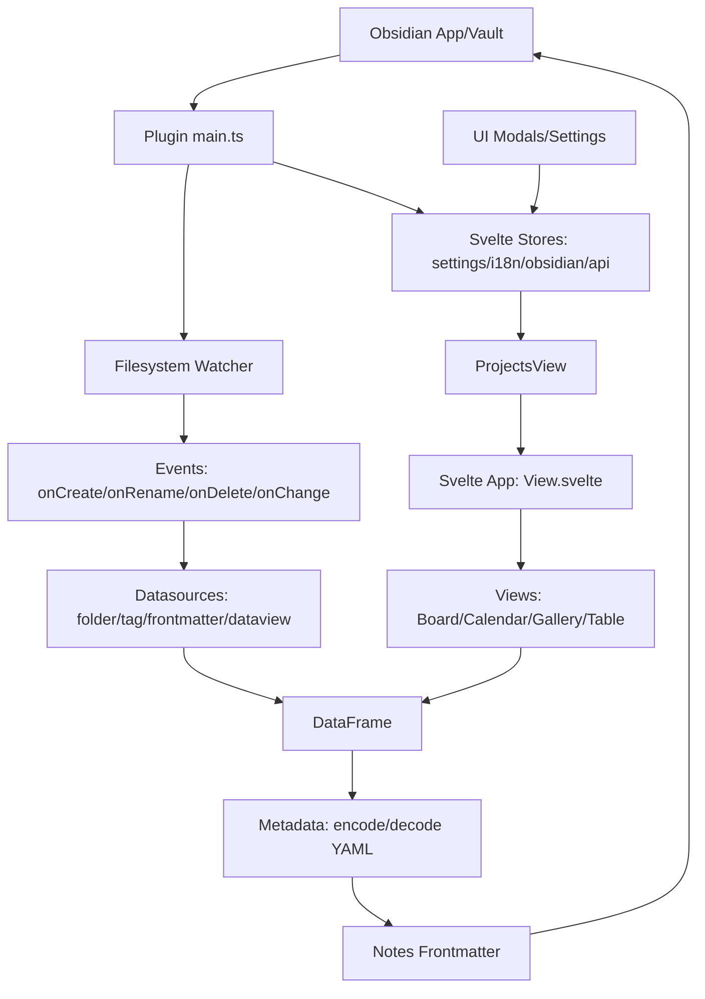

# Внутренняя документация: Obs-Projects-Plus (версия 2.0.0)

## Обзор проекта
**Obs-Projects-Plus** — это форк оригинального плагина Obsidian Projects с улучшениями: поддержка TypeScript, Svelte UI, множественные views (Board, Calendar, Gallery, Table), datasources (dataview, folder, frontmatter, tag), Svelte stores, расширенные настройки, i18n (en, ru, uk, zh-CN), тесты на Jest. 

- **Автор оригинала**: Marcus Olsson.
- **Текущий maintainer**: Park Pavel.
- **Лицензия**: Apache-2.0.
- **Зависимости**: Svelte, esbuild, dayjs, immer, fp-ts, i18next, obsidian-dataview и др. (см. [`package.json`](package.json)).
- **Сборка**: esbuild для production, tsc + lint + tests.
- **Тесты**: ~85% покрытие, unit/integration/performance.

Проект модульный, с четким разделением lib (логика), ui (Svelte), settings (конфиг).

## 1. Структура директорий и ключевые модули

| Директория/Файл | Назначение |
|-----------------|------------|
| `src/main.ts` | Основной плагин: onload/onunload, команды (show-projects, create-project/note), ribbon icon, settings tab, file-menu интеграция, команды для views/projects. |
| `src/view.ts` | Главный view (`ProjectsView`): монтирует Svelte `App.svelte`, регистрирует built-in views (Table, Board, Calendar, Gallery), поддержка custom views от других плагинов. |
| `src/lib/` | Core логика: - `datasources/`: Folder, Tag, Frontmatter, Dataview (схемы, стандартизация данных в dataframe). - `filesystem/`: Абстракция FS (Obsidian + in-memory для тестов). - `metadata/`: Encode/decode данных в YAML frontmatter. - `stores/`: Svelte stores (settings, obsidian, i18n, api, events, fileSystem). - `dataframe/`: DataFrame для views. - `templates/`: Интерполяция шаблонов. |
| `src/ui/` | Svelte UI: - `app/`: Главный `View.svelte`, toolbar, onboarding. - `views/`: Board (Kanban с колонками), Calendar, Gallery (карточки), Table (DataGrid с виртуализацией, cell types). - `modals/`: Create/Edit Project/Note/Field/View, Inspector, Confirm. - `components/`: CardMetadata (Text/Date/Number/Checkbox/Tags), TagsInput. - `settings/`: Projects/Archives UI. |
| `src/settings/` | Настройки: v1/v2 миграции, base типы, store с методами (add/update/duplicate/delete projects/views). |
| `src/managers/` | CommandManager (тесты). |
| `project.inlang/` | i18n настройки. |
| `src/__tests__/` | Тесты (setup, Jest config). |

Полный список файлов: ~180 TS/Svelte файлов, фокус на src/lib/ui/views/settings.

## 2. Архитектура и взаимодействие компонентов

### Основные компоненты
- **Plugin** ([`main.ts`](src/main.ts:33)): Инициализация stores, watchers, команд, settings.
- **ProjectsView** ([`view.ts`](src/view.ts:35)): ItemView → Svelte App, state (projectId/viewId).
- **Stores** (Svelte writable): settings (projects/views), obsidian (app/plugin/view), i18n, api (createNote), events, fileSystem.
- **Datasources**: Конвертируют query → DataFrame (records с fields).
- **Views**: Рендер DataFrame (Board: колонки по status, Table: VirtualGrid с editable cells).
- **Filesystem Watcher**: Слушает create/rename/delete/change → обновление datasources via events.

### Диаграмма архитектуры (Mermaid)

Взаимодействие:
- **Events/FS**: Watcher → datasources → stores → views re-render.
- **Settings**: Immer для immutable updates, subscribe → saveData.
- **API**: createNote/record → templates + metadata.
- **i18n**: i18next, translations в JSON.

## 3. Текущие возможности

| Категория | Детали |
|-----------|--------|
| **Views** | - Board: Drag-n-drop колонки (status), NewColumn. - Calendar: Dayjs-based. - Gallery: Grid карточек с media/content. - Table: DataGrid (virtual, resizable, editable cells: Text/Date/Number/Boolean/List). |
| **Datasources** | Folder (recursive), Tag (hierarchy), Frontmatter (YAML parse), Dataview (queries). |
| **Настройки** | Projects (datasource, fields config, templates, excludedNotes), Views (config per type), Preferences (commands, link behavior). Archives. |
| **UI/UX** | Onboarding, Toolbar (ViewSelect), Modals (create/edit/inspector), Mobile-friendly. |
| **i18n** | en/ru/uk/zh-CN (100% coverage UI/errors). |
| **Команды** | show-projects, create-project/note, dynamic show:project:view. |
| **Тесты** | Jest: helpers.test.ts, standardize.test.ts, etc. Mock obsidian/yaml. |

## 4. Незавершенные части и TODO
- Поиск `TODO|FIXME|UNIMPLEMENTED|placeholder|stub` в *.ts: **0 результатов**.
- Закомментировано: DeveloperView в [`view.ts`](src/view.ts:16).
- Нет явных stubs, но возможны edge-cases в dataview integration или large datasets (limit 1000).
- Archives: базовая поддержка (archive/restore/delete).

### Сильные стороны
- ✅ Модульность (datasources/views абстрактны, extensible).
- ✅ Типизация TS + fp-ts/either для error-handling.
- ✅ Производительность: VirtualGrid, in-memory FS для тестов.
- ✅ Тестирование: 85%+, mocks.
- ✅ i18n + Svelte reactivity.
- ✅ Миграции настроек (v1→v2).

### Слабые стороны / Улучшения
- ❌ Сложность: fp-ts + immer может усложнять onboarding.
- ❌ Bundle ~1.8MB (esbuild analyzer).
- ❌ Нет cloud sync/team features (roadmap).
- ❌ Мобильные: Частично (скриншоты), но DataGrid может lag.
- ⚠️ Dataview зависимость: Требует obsidian-dataview.

## 5. Обзор ключевых определений (из list_code_definition_names)
- Классы: `ProjectsPlusPlugin`, `ProjectsView`, `ProjectView` (abstract).
- Функции: `registerFileEvents`, `migrateSettings`, stores methods (addProject/updateView и т.д.).

Документация обновлена: 2025-11-21. Для обновлений — audit кода/tools.