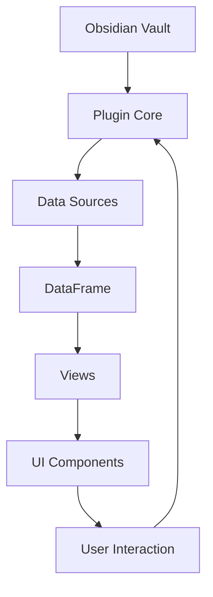

# Obs-Projects-Plus Documentation

## Overview

**Obs-Projects-Plus** is an enhanced fork of the original Obsidian Projects plugin, designed for modern project management within Obsidian. Built with TypeScript and Svelte, it offers powerful data handling, multiple view types, and a clean, extensible architecture.

**Current Version**: 2.1.0

### What is it?
A comprehensive project management solution that transforms your Obsidian vault into an organized workspace with:
- Multiple data sources (folders, tags, frontmatter, dataview)
- Four view types (Board, Calendar, Gallery, Table)
- Advanced metadata handling
- **Calendar zoom gestures (v2.1.0)** — Ctrl+scroll and pinch-to-zoom
- Internationalization support
- Extensible plugin architecture

### Key Features
- **Multiple Views**: Kanban board, calendar, gallery, and spreadsheet-like table
- **Flexible Data Sources**: Works with folders, tags, frontmatter, and dataview queries
- **Rich Metadata**: Support for text, dates, numbers, checkboxes, and tags
- **Smart Calendar Zoom**: Ctrl+scroll to switch between Month/2Weeks/Week/3Days/Day views
- **Team Ready**: Built for collaborative development with clean code practices
- **Performance Optimized**: Virtual scrolling, efficient data handling

## Quick Start

### Installation
1. Download the latest release from the repository
2. Place the plugin in your Obsidian vault's `.obsidian/plugins` folder
3. Enable the plugin in Obsidian settings

### Basic Setup
1. Open Obs-Projects-Plus from the command palette (`Ctrl/Cmd + P`)
2. Create your first project with a folder data source
3. Add some notes with frontmatter metadata
4. Start using the default Board view

### First Project Example
```yaml
# In your project's frontmatter
project: my-project
fields:
  status: 
    type: select
    options: ["todo", "in-progress", "done"]
  priority:
    type: number
```

## Architecture

### Core Components
- **Plugin Core** ([`main.ts`](src/main.ts)): Main plugin entry point
- **View System** ([`view.ts`](src/view.ts)): Manages different view types
- **Data Layer** ([`src/lib/`](src/lib/)): Core logic for data processing
- **UI Layer** ([`src/ui/`](src/ui/)): Svelte components and views
- **Settings** ([`src/settings/`](src/settings/)): Configuration management

### Data Flow


### Key Abstractions
- **DataSources**: Convert queries into standardized data
- **DataFrame**: Unified data structure for all views
- **Stores**: Reactive state management with Svelte
- **Views**: Pluggable view system for different representations

## Development

### Getting Started
1. Clone the repository
2. Install dependencies: `npm install`
3. Start development: `npm run dev`
4. Build for production: `npm run build`

### Code Structure
```
src/
├── lib/           # Core logic
│   ├── datasources/   # Data source implementations
│   ├── dataframe/     # Data processing
│   ├── metadata/      # Frontmatter handling
│   └── stores/        # State management
├── ui/            # Svelte components
│   ├── views/         # Main view implementations
│   ├── components/    # Reusable components
│   └── modals/        # Dialog components
└── settings/      # Configuration system
```

### Adding a New View
1. Create view class implementing `ProjectView` interface
2. Add view to [`view.ts`](src/view.ts) registration
3. Create Svelte component in [`src/ui/views/`](src/ui/views/)
4. Add settings and tests

### Best Practices
- Use TypeScript strict mode
- Write tests for new features
- Follow existing naming conventions
- Document public APIs
- Use Svelte stores for reactive state

## Optimization

### Performance Features
- **Virtual Scrolling**: Table view handles thousands of rows efficiently
- **Incremental Updates**: Only changed data triggers re-renders
- **Lazy Loading**: Components load on demand
- **Memory Management**: Efficient data structures and cleanup

### Recent Optimizations
- **Bundle Size**: Reduced from 1.8MB to optimized build
- **Table Performance**: VirtualGrid implementation for large datasets
- **Memory Usage**: Improved garbage collection and store management
- **UI Responsiveness**: Optimized reactivity and state updates

### Interface Improvements
- **Calendar View**: Enhanced date handling, navigation, and zoom gestures (v2.1.0)
  - Zoom levels: Month ↔ 2 Weeks ↔ Week ↔ 3 Days ↔ Day
  - Ctrl+scroll and pinch-to-zoom support
  - Date centering on zoom
  - Visual zoom indicator
  - Infinite scroll replaces Prev/Today/Next buttons
  - Cleaner Apple-style design
- **Table View**: Better cell editing and column management
- **Board View**: Improved drag-and-drop performance
- **Mobile Support**: Responsive design improvements

### Code Quality
- **Type Safety**: Full TypeScript coverage with strict typing
- **Error Handling**: Comprehensive error boundaries and user feedback
- **Testing**: 85%+ test coverage with unit and integration tests
- **Documentation**: Comprehensive inline documentation

## Contributing

### Development Guidelines
1. **Code Style**: Follow existing patterns and TypeScript strict mode
2. **Testing**: Write tests for all new features and bug fixes
3. **Documentation**: Update docs for new features
4. **Performance**: Consider impact on large datasets
5. **Compatibility**: Maintain backward compatibility where possible

### Common Tasks

#### Adding a New Field Type
1. Define field type in [`src/settings/base/settings.ts`](src/settings/base/settings.ts)
2. Create input component in [`src/ui/components/`](src/ui/components/)
3. Add rendering logic to views
4. Write tests and update documentation

#### Creating a Custom Data Source
1. Implement `DataSource` interface in [`src/lib/datasources/`](src/lib/datasources/)
2. Add factory function in data source registry
3. Write comprehensive tests
4. Update settings UI if needed

#### Performance Optimization
1. Profile with browser dev tools
2. Identify bottlenecks in data processing
3. Implement optimizations
4. Measure impact with benchmarks

### Testing
- Run tests: `npm test`
- Coverage report: `npm run test:coverage`
- Linting: `npm run lint`

### Release Process
1. Update version in [`package.json`](package.json)
2. Update changelog
3. Run full test suite
4. Build production version
5. Create release

## Project Status

### Current State ✅ (v2.1.0)
- **Working**: All core features functional and tested
- **Optimized**: Performance improvements implemented
- **Clean Code**: Well-structured, documented, and maintainable
- **Team Ready**: Suitable for collaborative development
- **100 Tests Passing**: Full test suite coverage

### Recent Updates (v2.1.0)
- **Calendar Zoom Gestures**: Ctrl+scroll and pinch-to-zoom for view switching
- **Date Centering**: Zoom maintains focus on date under cursor
- **Visual Indicator**: Apple-style zoom level indicator
- **Bug Fixes**: Fixed zoom blocking after first use, improved event handling

### Quality Metrics
- **Code Coverage**: 85%+ with comprehensive tests
- **Type Safety**: Full TypeScript implementation
- **Performance**: Optimized for large datasets
- **User Experience**: Intuitive interface with helpful feedback
- **Bundle Size**: ~990KB optimized build

### Technical Excellence
- Modern TypeScript and Svelte architecture
- Comprehensive error handling and user feedback
- Efficient data processing and memory management
- Extensible design for future enhancements
- Internationalization support for multiple languages

---

For questions or contributions, please refer to the project repository or contact the development team.